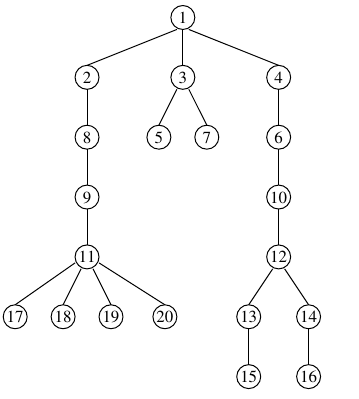

## 문제

Byteasar has designed a supercomputer of novel architecture. It may comprise of many (identical) processing units. Each processing unit can execute a single instruction per time unit.

The programs for this computer are not sequential but rather have a tree structure. Each instruction may have zero, one, or multiple subsequent instructions, for which it is the parent instruction.

The instructions of the program can be executed in parallel on all available processing units. Moreover, they can be executed in many orders: the only restriction is that an instruction cannot be executed unless its parent instruction has been executed before. For example, as many subsequent instructions of an instruction that has been executed already can be executed in parallel as there are processing units.

Byteasar has a certain program to run. Since he likes utilizing his resources optimally, he is wondering how the number of processing units would affect the running time. He asks you to determine, for a given program and number of processing units, the minimum execution time of the program on a supercomputer with this many processing units.

## 입력

In the first line of standard input, there are two integers, n and q(1 ≤ n,q ≤ 1,000,000), separated by a single space, that specify the number of instructions in Byteasar's program and the number of running time queries (for different numbers of processing units).

In the second line of input, there is a sequence of q integers, k1,k2,…,kq(1 ≤ ki ≤ 1,000,000), separated by single spaces: ki is the number of processing units in Byteasar's i-th query.

In the third and last input line, there is a sequence of n-1 integers, a2,a3,…,an(1 ≤ ai < i), separated by single spaces: ai specifies the number of the parent instruction of the instruction number i. The instructions are numbered with successive integers from 1 to n, where the instruction no. 1 is the first instruction of the program.

In tests worth 35% of the total score the condition n ≤ 30,000, q ≤ 50 holds. Moreover, in a subset of those worth 20% of the total score n ≤ 1,000, q ≤ 10 holds in addition.

## 출력

Your program should print one line consisting of q integers, separated by single spaces, to the standard output: the i-th of these numbers should specify the minimum execution time of the program on a supercomputer with ki processing units.

## 힌트

The program can be executed as follows:

Time    Instructions  
  1          1

  2         2  3  4

  3         5  6  7

  4         8  10

  5         9  12

  6         11 13 14

  7         15 16 17

  8         18 19 20

—————  
Sample grading tests:

* 1ocen: n=10, q=2, instruction tree is a path;
* 2ocen: n=10, q=3, a small random test;
* 3ocen: n=100, q=3, all instructions other than 1 are its subsequent instructions;
* 4ocen: n=127, q=1, instructions form a complete binary tree;
* 5ocen: n=1,000,000, q=31, instruction tree is a long path.
