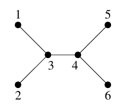

## 문제

In a village called Byteville, there are n houses connected with n-1 roads. For each pair of houses, there is a unique way to get from one to another. The houses are numbered from 1 to n. The house no. 1 belongs to the village administrator Byteasar. As part of enabling modern technologies for rural areas framework, n computers have been delivered to Byteasar's house. Every house is to be supplied with a computer, and it is Byteasar's task to distribute them. The citizens of Byteville have already agreed to play the most recent version of FarmCraft (the game) as soon as they have their computers.

Byteasar has loaded all the computers on his pickup truck and is about to set out to deliver the goods. He has just the right amount of gasoline to drive each road twice. In each house, Byteasar leaves one computer, and immediately continues on his route. In each house, as soon as house dwellers get their computer, they turn it on and install FarmCraft. The time it takes to install and set up the game very much depends on one's tech savviness, which is fortunately known for each household. After he delivers all the computers, Byteasar will come back to his house and install the game on his computer. The travel time along each road linking two houses is exactly 1 minute, and (due to citizens' eagerness to play) the time to unload a computer is negligible.

Help Byteasar in determining a delivery order that allows all Byteville's citizens (including Byteasar) to start playing together as soon as possible. In other words, find an order that minimizes the time when everyone has FarmCraft installed.

## 입력

The first line of the standard input contains a single integer n(2 ≤ n ≤ 500,000) that gives the number of houses in Byteville. The second line contains n integers c1, c2, ..., cn(1 ≤ ci ≤ 109), separated by single spaces; ci is the installation time (in minutes) for the dwellers of house no. i.

The next n-1 lines specify the roads linking the houses. Each such line contains two positive integers a and b (1 ≤ a < b ≤ n), separated by a single space. These indicate that there is a direct road between the houses no. a and b.

You may assume that in tests worth 10% of the total points, the condition n ≤ 7000 holds.

## 출력

The first and only line of the standard output should contain a single integer: the (minimum) number of minutes after which all citizens will be able to play FarmCraft together.

## 힌트

Byteasar should deliver the computers to the houses in the following order: 3, 2, 4, 5, 6, and 1. The game will be installed after 11, 10, 10, 10, 8, and 9 minutes respectively, in the house number order. Thus everyone can play after 11 minutes.

If Byteasar delivered the game in the following order: 3, 4, 5, 6, 2, and 1, then the game would be installed after: 11, 16, 10, 8, 6, and 7 minutes respectively. Hence, everyone could play only after 16 minutes,
