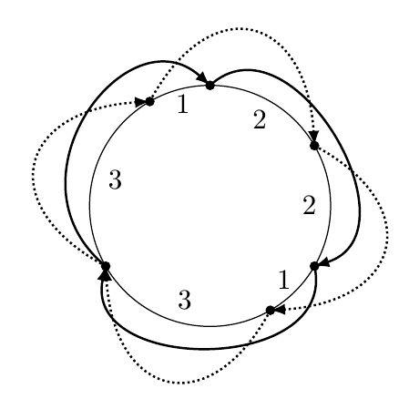

## 문제

After trying hard for many years, Byteasar has finally received a pilot license. To celebrate the fact, he intends to buy himself an airplane and fly around the planet 3-SATurn (as you may have guessed, this is the planet on which Byteotia is located). Specifically, Byteasar plans to fly along the equator. Unfortunately, the equator is rather long, necessitating refuels. The flight range (on full tank) of each aircraft is known. There is a number of airports along the equator, and a plane can be refueled when it lands on one. Since buying an airplane is a big decision, Byteasar asks your help. He is about to present you with a list of different plane models he is considering. Naturally, these differ in their flight range. For each plane model, he would like to know the minimum number of landings (including the final one) he would have to make in order to complete the journey. Note that for each airplane model, the journey may start at a different airport.

## 입력

The first line of the standard input contains two integers n and s(2 ≤ n ≤ 1,000,000, 1 ≤ s ≤ 100), separated by a single space, denoting the number of airports along the equator and the number of airplane models Byteasar is considering.

The second line contains n positive integers l1,l2,…,ln(l1+l2+…+ln ≤ 109), separated by single spaces, specifying the distances between successive airports along the equator. The number li is the distance between the i-th and (i+1)-st (or n-th and first if i=n) in kilometers.

The third line contains s integers d1,d2,…,ds(1 ≤ di ≤ l1+l2++ln), separated by single spaces. The number di is the i-th airplane model's flight range in kilometers, i.e., the maximum distance it can fly before landing and refueling.

In tests worth 50% of the total score, it holds that n ≤ 100,000, and in their subset worth 20% of the total score, it even holds that n ≤ 1,000.

In a different subset of tests (disjoint with those previously mentioned), worth 18% of the total score, s ≤ 5 holds.

## 출력

Your program should print  lines to the standard output: the i-th of these should contain a single integer, namely, the minimum lumber of flight segments (and thus also landings) necessary to fly the i-th airplane around the planet 3-SATurn along the equator, starting at an airport of choice, or the word NIE (Polish for no) if it is impossible to complete the journey with this airplane.

## 힌트

The thick solid line shows the optimal journey of the plane with flight range 4, whereas the dashed line the optimal journey of the plane with flight range 3.
