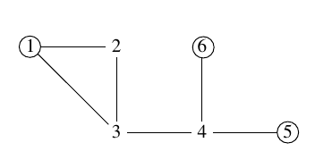

## 문제

King Byteasar believes that Byteotia, a land full of beautiful sights, should attract lots of tourists, who should spend lots of money, which should eventually find their way to the royal treasury. But reality does not live up to his dream. So the king instructed his councilor to look into this issue. The councilor found out that foreigners keep away from Byteotia due to its sparse road network.

Let us remark that there are n towns in Byteotia, connected by m two way roads, each road linking two different towns. The roads may lead through picturesque overflies and somewhat less picturesque tunnels. There is no guarantee that every town can be reached from every other town.

The councilor observed that the current road network does not allow for a long journey. Namely, wherever one starts the journey, it is impossible to visit more than 10 towns without passing through some town twice.

Due to limited funds in the treasury, no new roads will be constructed at the time. Instead, Byteasar has decided to build a network of tourist information points (TIPs), staffed by officers who are to advertise the short trips that are available. For each town, there should be a TIP either in this town or one of the towns directly linked by a road. Moreover, the cost of building the TIP is known for each town. Help the king by finding the cheapest way of building TIPs that will satisfy aforementioned condition.

## 입력

The first line of the standard input contains two integers n, m(2 ≤ n ≤ 20,000, 0 ≤ m ≤ 25,000), separated by a single space, that specify the number of towns and roads in Byteotia respectively. The towns are numbered from 1 to n. The second line of input contains n integers c1,c2,…,cn(0 ≤ ci ≤ 10,000), separated by single spaces; the number ci specifies the cost of building a TIP in the town no. i.

Then, a description of the Byteotian road network follows. The i-th of the following m lines contains two integers ai, bi(1 ≤ ai < bi ≤ n), separated by a single space, that indicate that the towns no. ai and bi are linked by a road. There is at most one (direct) road between any pair of towns.

In tests worth 20% of the total score, the condition n ≤ 20 holds.

## 출력

Your program should print out one integer to the standard output: the total cost of building all the TIPs.

## 힌트

To attain the minimum, the TIPs should be built in towns no. 1, 5, and 6. (the cost will be 3+2+2=7).
