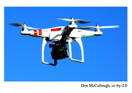

## 문제

BASIN CITY is known for her incredibly high crime rates. The police see no option but to tighten security. They want to install traffic drones at different intersections to observe who’s running on a red light. If a car runs a red light, the drone will chase and stop the car to give the driver an appropriate ticket. The drones are quite stupid, however, and a drone will stop before it comes to the next intersection as it might otherwise lose its way home, its home being the traffic light to which it is assigned. The drones are not able to detect the presence of other drones, so the police’s R&D department found out that if a drone was placed at some intersection, then it was best not to put any drones at any of the neighbouring intersections. As is usual in many cities, there are no intersections in BASIN CITY with more than four other neighbouring intersections.

The drones are government funded, so the police force would like to buy as many drones as they are allowed to. Being the programmer-go-to for the BASIN CITY POLICE DEPARTMENT, they ask you to decide, for a given number of drones, whether it is feasible to position exactly this number of drones.

## 입력

The first line contains an integer k (0 ≤ k ≤ 15), giving the number of drones to position. Then follows one line with 1 ≤ n ≤ 100 000, the total number of intersections in BASIN CITY. Finally follow n lines describing consecutive intersections. The i-th line describes the i-th intersection in the following format: The line starts with one integer d (0 ≤ d ≤ 4) describing the number of intersections neighbouring the i-th one. Then follow d integers denoting the indices of these neighbouring intersections. They will be all distinct and different from i. The intersections are numbered from 1 to n.

## 출력

If it is possible to position k drones such that no two neighbouring intersections have been assigned a drone, output a single line containing possible. Otherwise, output a single line containing impossible.
