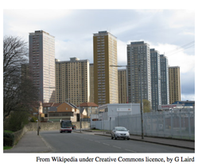

## 문제

For the grand opening of the algorithmic games in NlogNsglow, a row of tower blocks is set to be demolished in a grand demonstration of renewal. Originally the plan was to accomplish this with controlled explosions, one for each tower block, but time constraints now require a hastier solution.

To help you remove the blocks more rapidly you have been given the use of a Universal Kinetic / Incandescent Energy Particle Cannon (UKIEPC). On a single charge, this cutting-edge contraption can remove either all of the floors in a single tower block, or all the x-th floors in all the blocks simultaneously, for user’s choice of the floor number x. In the latter case, the blocks that are less than x floors high are left untouched, while for blocks having more than x floors, all the floors above the removed x-th one fall down by one level.

Given the number of floors of all towers, output the minimum number of charges needed to eliminate all floors of all blocks.

## 입력

The first line of input contains the number of blocks n, where 2 ≤ n ≤ 100 000. The second line contains n consecutive block heights hi for i = 1, 2, ... , n, where 1 ≤ hi ≤ 1 000 000.

## 출력

Output one line containing one integer: the minimum number of charges needed to tear down all the blocks.
