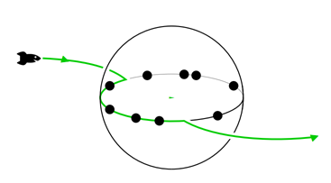

## 문제

In a galaxy far away, the planet Equator is under attack! The evil gang Galatic Criminal People Cooperation is planning robberies in Equator’s cities. Your help is needed! In order to complete your training for becoming a lord of the dark side you should help them deciding which cities to rob. As the name says, the desert planet Equator only can be inhabited on its equator. So the gang lands there at some point and travels into some direction robbing all cities on their way until leaving the planet again.

But what is still open for them is to decide where to land, which direction to take, and when to leave. Maybe they shouldn’t even enter the planet at all? They do not consider costs for traveling or for running their ship, those are peanuts compared to the money made by robbery!

The cities differ in value: some are richer, some are poorer, some have better safety functions. So the gang assigned expected profits or losses to the cities. Help them deciding where to begin and where to end their robbery to maximize the money in total when robbing every city in between.

## 입력

The input starts with the number of test cases T ≤ 30. Each test case starts a new line containing the number of cities 1 ≤ n ≤ 1 000 000. In the same line n integers ci follow. Each ci (0 ≤ i < n, −1000 ≤ ci ≤ +1000) describes the money obtained when robbing city i, a negative ci describes the amount of money they would lose.

## 출력

For each test case print one integer describing the maximum money they can make in total.
