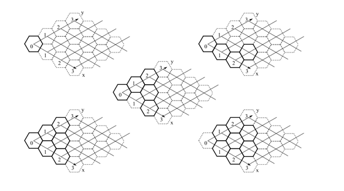

## 문제

In 1996, the Czech Technical University already organized the 2nd year of the programming contest. The problem set contained a very interesting problem about n-dimensional hyperex hypergons. This single problem gave a uniting theme to the whole 1996 CTU Open contest: all problems involved the launch of a fictional hyper-cosmic spaceship Nostromo. This quickly became a tradition and since then, CTU Open Contest problem sets have common themes.

We wanted to present the Hyperex Hypergons to you today but we finally decided that they are a little bit too difficult (no team did even try to solve it back in 1996), so we only recommend the problem to your attention — maybe you would like to give it a try and solve it after this contest is over? We will publish the problem statement on our web page. For this competition, we instead present you an English translation of another problem from the 1996 set.

---

An important task of the hyper-cosmic spaceship Nostromo is to establish a permanent base on the orbit of the planet MX8-26B in the Centaurus constellation. The base is built from complexes composed of identical hexagonal cubicles. Each of the six sides of each cubicle contains a hole serving either as a passage to a neighboring cubicle or as a window in case when no cubicle o  the finished base is neighboring at this side. The complexes can be composed of the cubicles in many different ways.

The travelers have a given number of complexes of several shapes at their disposition. Every cubicle in the finished base accommodates as many people as the number of windows it has. Write a program to determine whether it is possible to build a base for the prescribed number of people given the descriptions of available complexes.

## 입력

The first line of the input contains the number of test cases N. The first line of each test case contains two space-separated positive integers P ≤ 1 000 000 and T ≤ 1000, where P is the number of inhabitants for whom the base is to be built and T is the number of shapes of available complexes.

Each of the following T lines contains integers separated by spaces describing one shape of a complex. The first two numbers on each of these lines are integers C and S, where C (0 ≤ C ≤ 1000) is the number of available complexes of this shape and S (1 ≤ S ≤ 1000) is the number of cubicles that make up the complex. It is known that every complex is connected and the hexagonal bottom bases of its cubicles lie in one plane.

The following S pairs of integers are the x and y coordinates of the centers of the hexagonal bases of the cubicles in a hexagonal coordinate system. The coordinates satisfy −10 000 000 ≤ x, y ≤ 10 000 000. The angle between the x-axis of the hexagonal coordinate system and the x-axis of the Cartesian coordinate system is −30◦. The angle between the y-axis of the hexagonal coordinate system and the x-axis of the Cartesian coordinate system is +30◦. See the following figure with drawings of five shapes from the first test case of the sample input.

## 출력

For each test case, print exactly one line. If it is possible to build the base, the line says “Je treba X celku.”, where X is the minimal possible number of complexes when the shapes and their connections are chosen optimally. Otherwise print “Kapacita zakladny je pouze X lidi.”, where X is the maximal number of people that can fit inside the optimal base built from all of the available complexes.
