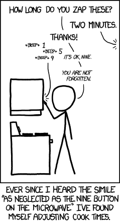

## 문제

You recently acquired a new microwave, and noticed that it provides a large number of buttons to be able to quickly specify the time that the microwave should be running for. There are buttons both for adding time, and for subtracting time. You wonder how efficient you can be when entering cooking times: you want to minimize the number of required button presses.

The microwave can be running for at least 0 seconds, and at most 1 hour. If a button press would result in a cooking time of less than 0 seconds, the microwave will set the cooking time to 0 seconds. If a button press would result in a cooking time of more than 1 hour, the microwave will set the cooking time to 1 hour. Initially, the microwave will run for 0 seconds. There will always be a button adding at least 1 second to the cooking time.

Given the buttons that the microwave provides for entering cooking times, determine the least amount of button presses required to let the microwave run for a certain amount of time. If it is not possible to enter the desired cooking time precisely, determine the smallest achievable cooking time above the target, and the minimum number of button presses required for that cooking time, instead. The microwave does not allow to adjust the cooking time once it has started cooking.

## 입력

On the first line one positive number: the number of test cases, at most 100. After that per test case:

* one line with two space-separated integers n and t (1 ≤ n ≤ 16 and 0 ≤ t ≤ 3 600): the number of buttons available to change the cooking time, and the desired cooking time in seconds, respectively.
* one line with n space-separated integers bi (−3 600 ≤ bi ≤ 3 600): the number of seconds added to the cooking time when button i is pressed.

## 출력

Per test case:

* one line with two space-separated integers: the minimum number of button presses required to reach the required cooking time, and the minimum number of extra seconds that the microwave must be running for, respectively.
