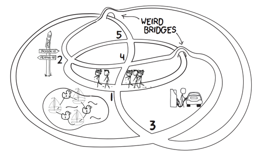

## 문제

Your sports club has a rivaling sports club in the same city. They did some awful things to you and you want to get back at them. You have learned that they are planning on doing a ’drop’: they drive people blindfolded to a city none of the participants know and tell them to find a specific place, the goal. They then have fun randomly walking through the city trying to find the goal.

You intend to spoil their fun thoroughly: you know that they promise a prize for whoever reaches the goal first, so the participants will use all available means to get to the goal. Indeed, you are fairly sure that if you set up official-looking signposts in that city in advance, they will probably follow them. You therefore decide to place signposts throughout the city so that no matter where the participants get dropped, they can follow the signposts to the goal; this takes out the element of ’randomly walking around’ and therefore all the fun.

However, official-looking signposts are not cheap and attract a lot of attention, particularly from police officers. So you wish to minimize the number of signposts you have to place in the city. This may lead the participants to use a very slow detour, but they don’t know the city anyway, so they won’t find out.

City of 2nd and 3rd sample input. The 2nd input has the goal at intersection 5 and the 3rd at 4.

You get yourself a map of the city and start planning. You notice one nice aspect of the city: all intersections are cross-shaped, so it is easy to predict where participants will go to: they will just go to the opposite side of the intersection they arrive at. If a participant gets dropped at an intersection with a signpost, he or she will follow that sign; otherwise they go in an arbitrary direction until they hit a sign post. You know that participants never get dropped at the goal (that would be silly).

## 입력

On the first line one positive number: the number of test cases, at most 100. After that per test case:

* one line with two space-separated integers n and g (5 ≤ n ≤ 100 000 and 1 ≤ g ≤ n): the number of intersections and the goal, respectively.
* n lines, each with four space-separated integers a, b, c and d (1 ≤ a, b, c, d ≤ n). The i-th line gives the intersections you end up at if you follow one of the roads adjacent to the i-th intersection; more precisely, participants who approach the i-th intersection coming from intersection a will continue towards intersection c and vice versa, while participants coming from intersection b will continue towards intersection d and vice versa.

Each intersection connects to four different other intersections.

## 출력

Per test case:

* one line with a single integer: the smallest number of signposts needed to ruin the fun.
