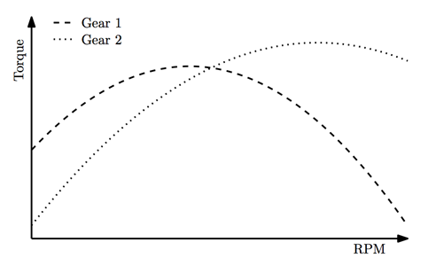

## 문제

The Best Acceleration Production Company specializes in multi-gear engines. The performance of an engine in a certain gear, measured in the amount of torque produced, is not constant: the amount of torque depends on the RPM of the engine. This relationship can be described using a torque-RPM curve.

The torque-RPM curve of the gears given in the second sample input.  
The second gear can produce the highest torque.

For the latest line of engines, the torque-RPM curve of all gears in the engine is a parabola of the form T = -aR2 + bR + c, where R is the RPM of the engine, and T is the resulting torque.

Given the parabolas describing all gears in an engine, determine the gear in which the highest torque is produced. The first gear is gear 1, the second gear is gear 2, etc. There will be only one gear that produces the highest torque: all test cases are such that the maximum torque is at least 1 higher than the maximum torque in all the other gears.

## 입력

On the first line one positive number: the number of test cases, at most 100. After that per test case:

* one line with a single integer n (1 ≤ n ≤ 10): the number of gears in the engine.
* n lines, each with three space-separated integers a, b and c (1 ≤ a, b, c ≤ 10 000): the parameters of the parabola T = -aR2 +bR+c describing the torque-RPM curve of each engine.

## 출력

Per test case:

* one line with a single integer: the gear in which the maximum torque is generated.
