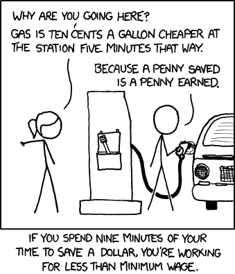

## 문제

A transport company has come to you for help. One of the biggest expenses that they have is the petrol for the trucks. They would like to minimize the money they need to spend on petrol.

Because of the long trips, a truck driver typically needs to stop multiple times at a petrol station to tank up. What complicates matters is that the price of petrol is not the same at every station. The differences could in fact be so significant that it pays to take a detour in order to visit a station with a low price. Yet another complication is that the price is not the same every day (but it does not change during the day).

The good news is that they can find out, every morning, what the price of petrol is at every station for that day. They also have, for every destination, a simple graph representing the relevant part of the road network, containing only the major intersections and petrol stations as nodes. Furthermore, they know for every road exactly how much petrol is needed to go from one node to the other, down to the milliliter; it does not depend on the direction or the amount of petrol in the tank. The truck drivers also have the ability to tank with milliliter precision.

It is perfectly fine for a truck to run out of petrol at the exact moment it arrives at a petrol station or at the destination; there is in fact a spare tank to allow for small fluctuations in fuel consumption, but that petrol is not supposed to be used. You may therefore ignore its existence.

A final thing to take into consideration is that the trucks have a fuel tank of limited size. With all that information, can you work out what the optimal path to the destination is, along with the optimal tanking strategy?

## 입력

On the first line one positive number: the number of test cases, at most 100. After that per test case:

* one line with three space-separated integers n, m and s (2 ≤ n ≤ 1 000 and 1 ≤ m ≤ 10 000 and 1 ≤ s ≤ 120): the number of nodes, edges and petrol stations, respectively.
* one line with a single integer t (1 ≤ t ≤ 100 000): the maximum amount of petrol that the fuel tank can hold in milliliters.
* m lines, each with three space-separated integers a, b and f (1 ≤ a, b ≤ n and a ≠ b and 1 ≤ f ≤ 100 000), indicating that there is a road between nodes a and b which takes f milliliters of petrol (fuel) to traverse.
* s lines, each with two space-separated integers x and p (1 ≤ x ≤ n and 1 ≤ p ≤ 100): the node x where each petrol station is located and the price p per milliliter of petrol at that station, respectively.
* one line with two space-separated integers c and d (1 ≤ c, d ≤ n and c ≠ d): the nodes where the company and the destination are located, respectively.

Every road is bidirectional. There is at most one road between any pair of nodes. There is always a petrol station at node c (it is right next to the company). The truck starts with an empty tank. The destination is guaranteed to be reachable.

## 출력

Per test case:

* one line with a single integer: the minimum amount of money that needs to be spent on petrol.
