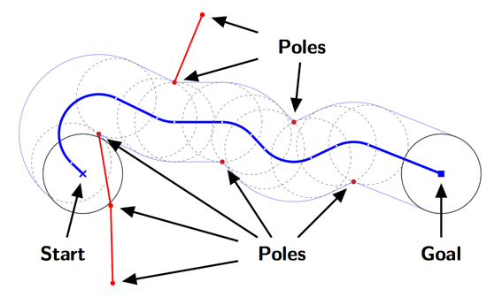
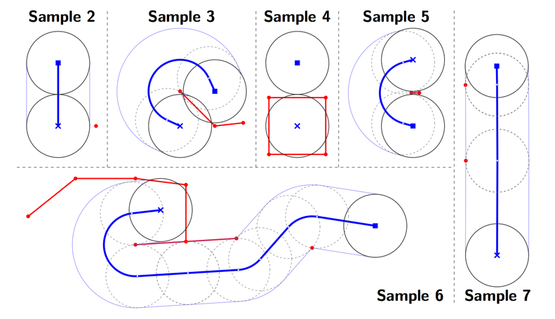

## 문제

You are invited to a robot contest. In the contest, you are given a disc-shaped robot that is placed on a flat field. A set of poles are standing on the ground. The robot can move in all directions, but must avoid the poles. However, the robot can make turns around the poles touching them.

Your mission is to find the shortest path of the robot to reach the given goal position. The length of the path is defined by the moving distance of the center of the robot. Figure H.1 shows the shortest path for a sample layout. In this figure, a red line connecting a pole pair means that the distance between the poles is shorter than the diameter of the robot and the robot cannot go through between them.



Figure H.1. The shortest path for a sample layout

## 입력

The input consists of a single test case.

```

N Gx Gy
x1 y1
.
.
.
xN yN
```

The first line contains three integers. N represents the number of the poles (1 ≤ N ≤ 8). (Gx, Gy) represents the goal position. The robot starts with its center at (0, 0), and the robot accomplishes its task when the center of the robot reaches the position (Gx, Gy). You can assume that the starting and goal positions are not the same.

Each of the following N lines contains two integers. (xi, yi) represents the standing position of the i-th pole. Each input coordinate of (Gx, Gy) and (xi, yi) is between −1000 and 1000, inclusive. The radius of the robot is 100, and you can ignore the thickness of the poles. No pole is standing within a 100.01 radius from the starting or goal positions. For the distance di,j between the i-th and j-th poles (i ≠ j), you can assume 1 ≤ di,j < 199.99 or 200.01 < di,j .

Figure H.1 shows the shortest path for Sample Input 1 below, and Figure H.2 shows the shortest paths for the remaining Sample Inputs.



Figure H.2. The shortest paths for the sample layouts

## 출력

Output the length of the shortest path to reach the goal. If the robot cannot reach the goal, output 0.0. The output should not contain an error greater than 0.0001.
