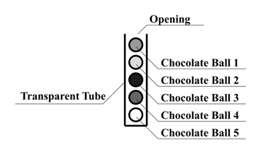

## 문제

There are two countries, Imperial Cacao and Principality of Cocoa. Two girls, Alice (the Empress of Cacao) and Brianna (the Princess of Cocoa) are friends and both of them love chocolate very much.

One day, Alice found a transparent tube filled with chocolate balls (Figure I.1). The tube has only one opening at its top end. The tube is narrow, and the chocolate balls are put in a line. Chocolate balls are identified by integers 1, 2, ..., N where N is the number of chocolate balls. Chocolate ball 1 is at the top and is next to the opening of the tube. Chocolate ball 2 is next to chocolate ball 1, ..., and chocolate ball N is at the bottom end of the tube. The chocolate balls can be only taken out from the opening, and therefore the chocolate balls must be taken out in the increasing order of their numbers.



Figure I.1. Transparent tube filled with chocolate balls

Alice visited Brianna to share the tube and eat the chocolate balls together. They looked at the chocolate balls carefully, and estimated that the nutrition value and the deliciousness of chocolate ball i are ri and si, respectively. Here, each of the girls wants to maximize the sum of the deliciousness of chocolate balls that she would eat. They are sufficiently wise to resolve this conflict peacefully, so they have decided to play a game, and eat the chocolate balls according to the rule of the game as follows:

1. Alice and Brianna have initial energy levels, denoted by nonnegative integers A and B, respectively.
2. Alice and Brianna takes one of the following two actions in turn:
   * **Pass:** she does not eat any chocolate balls. She gets a little hungry – specifically, her energy level is decreased by 1. She cannot pass when her energy level is 0.
   * **Eat:** she eats the topmost chocolate ball – let this chocolate ball i (that is, the chocolate ball with the smallest number at that time). Her energy level is increased by ri, the nutrition value of chocolate ball i (and NOT decreased by 1). Of course, chocolate ball i is removed from the tube.
3. Alice takes her turn first.
4. The game ends when all chocolate balls are eaten.

You are a member of the staff serving for Empress Alice. Your task is to calculate the sums of deliciousness that each of Alice and Brianna can gain, when both of them play optimally.

## 입력

The input consists of a single test case. The test case is formatted as follows.

```

N A B
r1 s1
r2 s2
.
.
.
rN sN
```

The first line contains three integers, N, A and B. N represents the number of chocolate balls. A and B represent the initial energy levels of Alice and Brianna, respectively. The following N lines describe the chocolate balls in the tube. The chocolate balls are numbered from 1 to N, and each of the lines contains two integers, ri and si for 1 ≤ i ≤ N. ri and si represent the nutrition value and the deliciousness of chocolate ball i, respectively. The input satisfies

* 1 ≤ N ≤ 150,
* 0 ≤ A, B, ri ≤ 109,
* 0 ≤ si, and
* Σsi ≤ 150.

## 출력

Output two integers that represent the total deliciousness that Alice and Brianna can obtain when they play optimally.
