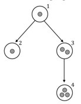

## 문제

Adi has fallen in love with Putri and they have been in relationship for years. Adi is now ready to propose Putri and ask her to marry him. However, Putri doesn’t seem want to make things easy for Adi. She asked Adi to play a game with her, and if he can win against her, then she will marry him.

At first, Putri drew one circle and put some marbles inside it. Next, she drew another circle and put some marbles inside it. She also drew one arrow from the previous drawn circle which point to this new circle. After that, she drew another circle, put some marbles inside it, and drew one arrow from one of the previously drawn circle to this new circle. These steps are repeated until she drew N circles, each with marbles (some circles might be empty). Note that no circles intersect each others and no circle contains another circle. After she had drawn those N circles, Putri then said “Let’s play a game”.

“We alternately take turn in this game. In each turn, the player should choose one circle … let say it’s the chosen circle. Take exactly one marble from the chosen circle, and move that marble to one of the circles which is pointed by the arrow originated from the chosen circle,” she explained. “The one who cannot make his or her move, lose”, she added. Wondering about this game, Adi then asked, “How about those circles which do not have any arrow originated from them? Can we take marble from those circles?” Putri then replied, “Ahh.. no, you cannot choose those circles. It’s a mandatory that you move one marble to another circle. Since you cannot move any marble from those circles, then you cannot choose them.” Putri then added, “Remember, you should move exactly one marble in your move, so obviously you cannot choose circles which do not have any marble inside it. Oh, by the way, the rule also applies to me”.

Adi realized that this kind of game has a fool-proof strategy. It means if both players play optimally, then the outcome of the game depends only on the initial configuration. Adi then asked Putri one crucial information, “So… who moves first?”. Putri replied, “I’ll let you decide that”. Adi then put a big smile on his face.

Given the initial game configuration, determine whether Adi should be the first player or the second player to be able to win the game. Assume Putri play optimally; in other words, Putri will surely beat Adi whenever she sees the chance.

## 입력

The first line of input contains an integer T (T ≤ 100) denoting the number of cases. Each case begins with an integer N (3 ≤ N ≤ 20,000) representing the number of circles drawn by Putri. The circles are numbered from 1 to N. The next line contains N integers Mi (0 ≤ Mi ≤ 1,000,000) denoting the number of marbles in ith circle respectively (1 ≤ i ≤ N). The following line contains N integers Pi (1 ≤ Pi < i ≤ N) denoting which circle has an arrow pointing to it. P1 is always 0, as it is the first circle drawn by Putri. This means no circle points to circle 1.

## 출력

For each case, output in a line "Case #X: Y" (without quotes) where X is the case number starting from 1, followed by a single space, and Y is “first” (without quotes) if Adi should take the first move in order to win the game, or “second” (without quotes) if he should play as second player.

## 힌트

For ease of explanation, let’s define some notations:

* move(a, b) as moving one marble from circle a to circle b.
* ⟨m0, m1, m2, …, ⟩ as the number of marbles in circle 1, 2, 3, …, respectively.

Explanation for 1st sample input

First player plays move(2, 3) resulting ⟨1, 0, 3⟩. Second player has no choice but to response with move(1, 2) resulting ⟨0, 1, 3⟩. First player win the game with move(2, 3) resulting ⟨0, 0, 4⟩.

Explanation for 2nd sample input

No matter what the first player does, he/she cannot win this game. There are 2 moves that can be played by the first player:

* move(1, 2), resulting ⟨0, 3, 2⟩; the two players then take turn moving marbles on circle 2 to circle 3, and this game will be won by the second player.
* move(2, 3), resulting ⟨1, 1, 3⟩; the second player then counter with move(2, 3) leaving ⟨1, 0, 4⟩. The first player has no choice but to play move(1, 2), which continued by the second player with move(2, 3) to conclude the game.

Therefore, in this game, Adi should be the second player in order to win.

Explanation for 3rd sample input

The following figure corresponds to the game configuration.

First player plays move(1, 2) resulting ⟨0, 2, 2, 3⟩. Second player has no choice but to response with move(3, 4) resulting ⟨0, 2, 1, 4⟩. First player then move the only marble in circle 3 to circle 4 and win the game.
