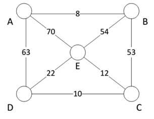

## 문제

Arturo has just bought a huge mansion in the Andes Mountains in Chile to study up closely on the chinchilla, an endangered rat species. They live in underground burrows or tunnels deep under the mansion, and will run and chase there along their own burrow circuits. They only dig up new burrows after a 30 days cycle.

Arturo has commission you to install motion-sensitive cameras to automatically activate the recording along these tunnels when these chinchilla pass through them. There should be at least one motion-sensitive camera along each of the possible running routes as he wants to capture all possible routes and their habits using minimum number of cameras. The underground burrows network can be represented as a series of connected intersections and bidirectional tunnel lanes (see Figure H). A possible running route consists of a start intersection A followed by a path consisting of two or more lanes (B, D, or E) that eventually leads back to the start intersection A. These running routes can start from any intersection.

Figure H: A sample burrow of intersections and connecting bidirectional tunnel lanes

Each running route starts and ends at the same intersection, and each lane in that running route can be travelled once only. The cameras are deployed on the lanes (e.g. between C and D, etc.) and not at the intersections. The cost of deploying a camera depends on the length of the lane on which it is placed (e.g. in Figure H, the length of lanes A-B, B-C and D-E are 8, 53 and 22 respectively). Thus, your task now can be summarized as to select a set of lanes that minimizes the total cost of deployment of these motion-sensitive cameras while ensuring that there is at least one camera along every possible running route or loop in the burrow network. Write a program that computes the optimal placement of these cameras in the connected burrows.

## 입력

The input consists of a line containing the number T of test cases, followed by T test cases, 0 < T < 1,001.

The first line of each dataset contains two positive integers, S and L, separated by a blank, which represent the number of intersections and number of lanes, respectively. You may assume that 0 < S < 10,001 and 0 < L < 100,001. Each of the S intersections is labeled from 1 to S. The following L lines of each dataset describe one lane per line. Each line consists of three positive integers which are the labels of two different intersections followed by the length of this lane. The length of each lane is between 1 and 5,000.

## 출력

For each case, output “Case #X: D M” (without quotes) in a line where X is the case number, starting from 1, followed by a single space, the integer D is the minimal total cost of setting up the chinchilla running and chasing monitoring system such that there is at least one motion-sensitive camera along every possible route, and integer M is the maximum length of the lane where a motion-sensitive camera is to be installed.
