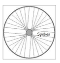

## 문제

Mr. Miyamoto is playing with a wheel. Each wheel can have many spokes. A spoke is one of the rods radiating from the center of a wheel (the hub where the axle connects), connecting the hub with the round traction surface. The wheel has 32 spokes with random of 0 or 1 as the value/tag for each spoke.

He has given a list of spokes, before and after its movement. His task is to calculate itsoptimal movement, whether the spokes move (in rotation) to the left or right. The list of spokes can be represented in a hexadecimal. For example: 800000001, means:

1000 0000 0000 0000 0000 0000 0000 0000 (list of spokes before its movement) and   
0000 0000 0000 0000 0000 0000 0000 0001 (after its movement)

From this example, he found that there are two possible rotations: move to the left 1 (one)time and move to the right 31 times. The optimal rotation is the minimal number to move (in rotation), which is move to the left 1 (one) time.

## 입력

The first line of input gives the number of test cases, T (1 ≤ T ≤ 1000), followed by a line which content of the N1 as a state before the spokes move and N2 as a state after the spokes move. Whereas N1, N2 are 32-bits integer in hexadecimal representation (1..F)

## 출력

For each case, output in a line "Case #X: Y" (without quotes) where X is the case number starting from 1, and Y is the minimum number of wheel’s spoke movements and followed by the direction to the “Left” or “Right”. If the number of movements to the left or right is the same, the direction will be written as “Any”. If N2 is not the final state of N1 then the output will be written as “Not possible”.
