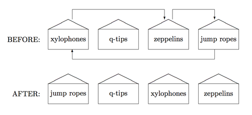

## 문제

You’ve been put in charge of reorganizing the inventory at Amalgamated, Inc. AI has factories at various sites around the country, each site manufacturing different sets of products. Currently, each site has all of their products stored in a row of warehouses, with each warehouse storing one type of product. Your idea is to move these products around so that the warehouses store the items in alphabetical order. For example, one site which manufactures xylophones, q-tips, zeppelins and jump ropes stores them in four warehouses as shown at the top of the following figure:

The arrows show how far each product would have to be moved in order for the warehouse to store them in alphabetical order, which is shown at the bottom of the figure.

Management likes your idea but is concerned about the cost of moving all of the products. The farther a product has to be moved, the more it costs, so before committing to any re-ordering they would like to know the total length that all products have to be moved at any given site. In the site above, xylophones would have to be moved a total length of 2 (measured in warehouses), zeppelins would have to move 1 and jump ropes would have to move 3, for a total cost of 6. What you need is a program that can determine this movement cost automatically.

## 입력

There will be multiple test cases. Each test case will start with a line containing a positive integer n indicating the number of products at the site. Following that will be one or more lines containing the n names of the products in their current order. Each name will be a single string, and a single space will separate each consecutive pair of names on any line. The maximum value of n is 1000, and no two product names will be the same. A single zero will terminate input.

## 출력

For each test case, output the site number followed by the total length of movements needed to reorganize the products. Follow the format shown in the Sample Output.
