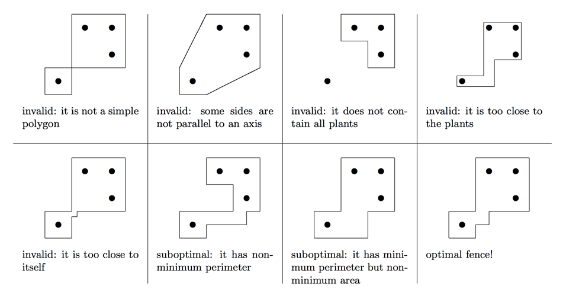

## 문제

At the early age of 40, Alice and Bob decided to retire. After more than two decades working as examples for networking protocols, game theoretical books and several other texts, they were tired. To remain active, they decided to go into gardening.

Alice and Bob planted several vegetable plants in a huge field. After finishing, they realized that their plants needed protection from wild animals, so they decided to build a fence around them.

The field is represented as the XY plane, and each vegetable plant as a different point in it. A fence is represented as a polygon in the plane. However, not every polygon is a valid fence. The fence needs to be a single simple polygon with each of its sides parallel to one of the axes. Of course, the polygon must contain all the points representing vegetable plants. A fence too close to the plants or to itself could make it difficult to walk around, so each side of the polygon needs to be at least 1 millimeter away from all plants and all non-adjacent sides.

Among all valid fences, Alice and Bob decided to build the one with minimum perimeter, in order to save on fence material. If there are several valid fences with minimum perimeter, they want to build one with minimum area among those, to save time when watering their garden.

In the following pictures, several different fences are shown in a field with four vegetable plants represented as circles.

Luckily, Alice and Bob’s background of participating in rigorous scientific projects made them very thorough with their records: they know the exact location of their plants with millimeter precision. Using this data, help them calculate the perimeter and area of an optimal fence.

## 입력

The first line contains an integer V (1 ≤ V ≤ 105) representing the number of vegetable plants in Alice and Bob’s field. Each of the next V lines describes a different vegetable plant with two integers X and Y (1 ≤ X, Y ≤ 108), indicating the coordinates of the plant, in millimeters. No two plants have the same location.

## 출력

Output a line with two integers P and A representing respectively the perimeter in millimeters and the area in squared millimeters of the fence that Alice and Bob want to build.
