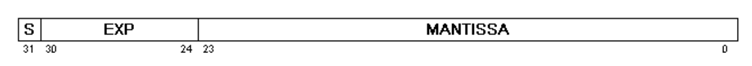
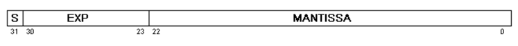

## 문제

지금은 쓰이지 않는 Gould의 부동소수점 방식을 차용하여 만든 어떤 소수를 IEEE 부동소수점 방식으로 가능한 한 정확히 변환하려 한다.

Gould의 부동소수점 방식은 아래와 같다.

1개의 Sign 비트와 7개의 지수부 비트, 24개의 가수부 비트로 이루어져 있으며, 이 비트들을 16진수로 나타낸다. 가수의 첫 세 비트까지 0이 될 수 있다.

위 방식으로 표현한 소수는 아래와 같은 값이 된다.

**value = ((-1)S)((16)(EXP-64))(MANTISSA / (224))**

EXP는 지수부, MANTISSA는 가수부를 의미한다.

이때, 0은 32개의 비트 0으로 이루어진다.

IEEE 부동소수점 방식은 아래와 같다.

1개의 Sign 비트, 8개의 지수부 비트, 24개의 가수부 비트로 이루어지며, 정규화된 수에서 가수부의 첫 비트는 항상 1이다. 이 항상 1인 하나의 비트는 가수부에 포함되지 않는다. 따라서 가수부는 23비트로 표현된다.

만일 지수 부분이 255가 아니고 0이 아닐 때 수는 정규화된 수이며, 아래와 같은 값을 가진다.

**value = ((-1)S)((2)(EXP-127))(1 + (MANTISSA / (223)))**

만일 지수 부분이 255이며 가수 부분이 0이라면, 이는 양의 무한대 또는 음의 무한대를 의미한다. 양과 음은 Sign 비트에 따라 결정된다.

만일 지수 부분이 255이며 가수 부분이 0이 아니라면, 이는 비정상적인 수이며 이 문제에서는 다루지 않을 것이다.

만일 지수 부분이 0이며 가수 부분이 0이라면, 이는 +0 또는 -0이다. (Sign 비트로 구분한다.)

만일 지수 부분이 0이며 가수 부분이 0이 아니라면, 이는 비정규 값이며 아래의 식에 따라 다르게 계산한다.

**value = ((-1)S)((2)(-126))(MANTISSA / (223))**

Gould의 방식으로 표현한 수가 주어진다. 이를 다음의 규칙에 따라 변환하여 출력한다.

* 만일 그 값이 0이라면 출력은 +0
* 만일 그 값이 정상적인 IEEE 부동소수점 방식으로 표현할 수 없을 만큼 클 경우, 양의 무한대 또는 음의 무한대. (Sign 비트로 구분)
* 만일 그 값이 정상적인 IEEE 부동소수점 방식으로 표현할 수 없을 만큼 작을 경우 :
  + 만일 비정규 값일 경우, 비정규 식으로 계산한 결과값
  + 비정규 값이 아닐 경우, +0 또는 -0. (Sign 비트로 구분)
* 다른 모든 경우에 대해서는 정규화된 IEEE 부동소수점 값 출력.

만일 IEEE 방식으로 표현했을 때 비트 수가 부족하다면 부족한 부분을 0으로 채운다.

만일 IEEE 방식으로 표현했을 때 비트 수가 남는다면 남는 부분을 제외한다.

## 입력

첫 줄에 테스트 케이스의 수 P가 주어진다. (1 ≤ P ≤ 1000)

각 테스트 케이스는 테스트 케이스의 번호와 Gould 방식의 부동소수점으로 표현한 수 하나가 16진수로 주어진다. 이 수는 0-9, A-F의 문자 8개로만 이루어져 있다.

## 출력

각 테스트 케이스마다, 테스트 케이스의 번호와 문제에서 설명한 방식대로 IEEE 방식으로 변환한 수를 16진수 8자리로 출력한다.
