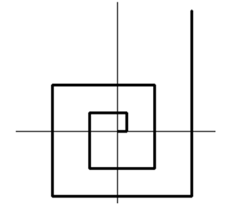

## 문제

자라나는 직교 나선이란 원점에서 출발하여 연속적으로 돌아가는 나선이다. 첫 부분은 항상 오른쪽으로 출발하며(양의 X축 방향), 그 다음 부분은 위로(양의 Y축 방향), 그 다음은 왼쪽으로(음의 X축 방향), 그 다음은 아래로(음의 Y축 방향) 진행한다. 단, 나선의 각 부분은 바로 이전의 부분보다 1 이상 증가한 길이를 가져야 한다. 첫 부분의 길이는 1 이상인 어떤 자연수라도 가능하다. 아래는 1,2,4,6,7,9,11,12,15,20의 길이로 자라나는 직교 나선의 예시이다.

1사분면의 어떤 점 (x,y)가 주어졌을 때, 직교 나선이 자라나서 그 점에 도달할 수 있을까? 있다면 어떤 방법으로 자라나는 것이 최소의 총합 길이를 가질까?

## 입력

첫 줄에 테스트 케이스의 수 P가 주어진다. (1 ≤ P ≤ 1000)

각 테스트 케이스는 테스트 케이스의 번호 T와 문제에서 설명한 점 X,Y로 이루어져 있다. (1 ≤ x ≤ 10000, 1 ≤ y ≤ 10000)

## 출력

각 테스트 케이스마다 테스트 케이스의 번호를 출력하고,

만일 어떤 방법으로 자라나더라도 도달할 수 없는 점이라면 NO PATH를, 도달 가능하다면 최소 총합 길이로 도달하기 위해 필요한 성장 횟수와 그 방법(매번 자라난 길이)을 출력한다.

점까지의 경로가 존재하는 모든 테스트 케이스에서 나선은 22회 이하의 성장으로 목적지에 도달 가능하다.
