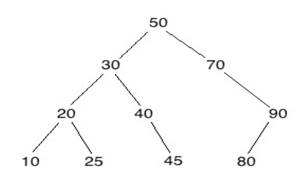

## 문제

A binary search tree is a common structure in computer science. A binary search tree is one in which all values in the left subtree of the root are smaller than the root value, all values in the right subtree of the root are bigger than the root value, and all subtrees in the tree are binary search trees. An empty tree is usually allowed as a binary tree, but we won’t be dealing with empty trees in this problem. Also, any ordered data type can be allowed for contents of nodes, but we will just be interested in trees that contain positive integers that are less than 1,000,000,000 (one billion).

For example, the following is a binary search tree.



A preorder traversal is defined by the following recursive pseudocode:

```

preorder_traversal(root)
    print the value in root [in general, process the value, but
    we will just print it]
    if root has a left subtree
        preorder_traversal(left subtree of root)
    if root has a right subtree
        preorder_traversal(right subtree of root)
```

A preorder traversal of the above binary search tree would give 50, 30, 20, 10, 25, 40, 45, 70, 90, 80.

Note that 2, 3, 1 is not the preorder traversal of any binary search tree since 2 would have to be in the root as the first value printed and then either 3 would be on the left side or 1 would be on the right side since 1 comes after 3 in the preorder traversal.

The problem here is to read a list of numbers and determine if it is the preorder traversal of a binary search tree.

## 입력

There may be multiple cases to process. Input for each case will consist of a list of positive integers followed by a negative integer that will signal end-of-list and should not be included in the list. Long lists may be given on more than one line. Do not assume a particular input format other than integers with whitespace separating them. You may assume the number of numbers in the list is a least 1 and at most 1,000. Process until the endof-file is detected.

## 출력

For each input case, print “yes” if the list is a valid preorder traversal of a binary search tree and “no” if not. Follow this format exactly: “Case”, one space, the case number, a colon and one space, and the answer for that case with no trailing spaces
