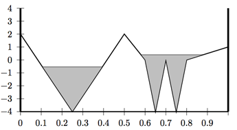

## 문제

Groundwater is a word to describe lakes, ponds, and rivers that form underground. Basically, when it rains, some of the water percolates through the layers of soil and rock and eventually ends up in these bodies of water somewhere under the surface. Groundwater reserves are used by plants with long enough roots to provide water even when rain has been missing for a while. Humans, too, often rely on groundwater, by drilling wells that reach far enough down to make the water reserves accessible. When there is a drought, as there is right now, the water reserves are partially or completely depleted (by humans and others). It may take quite a bit of rain to raise them again.

In this problem, we will assume that the groundwater reserves are completely depleted, and you will calculate to which extent they are refilled as a result of rainfall. We will give you a contour of the rock at the bottom of the groundwater reservoir. This will be a sequence of (xi, yi) pairs, with x0 = 0, and the last one xn = 1. They will be given by strictly increasing xi. We also promise that no line will be exactly horizontal, so you will always be able to calculate where the water landing in a spot is flowing.

We assume that the reservoir starts completely empty, and that it rains for a given amount of time at a given rate. (A rate of r means that r units of rain hit the surface per unit of time.) Your goal is to output the highest level at which groundwater will be anywhere on the map. See the figure for an illustration.

Figure 1: A schematic drawing of groundwater. The shaded areas are full of water after one unit of rain at a rate of 1. Thus, the highest level of groundwater is 0.4 (on the right).

## 입력

The first line is the number K of input data sets, followed by the K data sets, each of the following form:

The first line contains three numbers n, r, t. The integer 2 ≤ n ≤ 50 is the number of points in the reservoir bottom contour line; The double 0.0 ≤ r ≤ 1000.0 is the rate at which rain falls. The double 0.0 ≤ t ≤ 1000.0 is the duration for which rain falls.

Next comes one line with 2n doubles, describing the points (xi, yi) of the reservoir bottom contour in the order x1 y1 x2 y2 . . . xn yn. We will guarantee that 0 = x1 < x2 < x3 < · · · < xn = 1, and −1000.0 ≤ yi ≤ 1000.0. Points with higher yi values are further up (so the sky is at +∞). Imagine that there are infinitely high walls at x = 0 and x = 1, so water cannot spill out of there.

## 출력

For each data set, output “Data Set x:” on a line by itself, where x is its number.

Then, output the highest level to which water has risen over the duration of the process, anywhere in the reservoir.

Each data set should be followed by a blank line.
