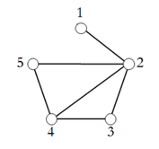

## 문제

Global warming is caused by air pollution in the sky and too much carbon dioxide in the atmosphere. Because of this, the North Pole ice plates are melting and the sea level is rising. As a result, a lot of cities will be under the sea. Also, there will be abnormal climate all over the world. To explore the exact status of the North Pole, ICPC (International Climate Protection Committee) would like to organize a team for the exploration. ICPC made a list of applicants for the exploration and acquired friendship information between the applicants. In order to select a team of closer cooperation, ICPC made the following rule:

Eligibility: For each member of the team, at least k friends of the member should be in the team.

Among eligible teams, ICPC will select a team of maximum size. For example, suppose there are 5 applicants and their friendship relations are represented by a graph in Figure 1. In the graph each vertex represents an applicant, and an edge between two vertices represents two applicants are friends. If k = 2, any of {2, 3, 4}, {2, 4, 5}, and {2, 3, 4, 5} satisfies the ICPC rule. Among the teams, the maximum size is 4. Therefore, ICPC will select {2, 3, 4, 5} as an exploration team. If k = 3, there is no team satisfying the rule.

Figure 1.

Given the friendship relations between n applicants and an integer k, you are to write a program to find the maximum size of the exploration team satisfying the ICPC rule.

## 입력

Your program is to read from standard input. The input consists of T test cases. The number of test cases T is given in the first line of the input. Each test case starts with a line containing three integers, n, k and f (1≤ k < n ≤ 2,000, 1 ≤ f ≤ n(n − 1)/2), where n is the number of applicants, k is the number specified in the ICPC rule, and f is the number of friendship relations. Each of the next f lines contains two integers representing two friends in the applicants. There is a single space between two integers in the same line.

## 출력

Your program is to write to standard output. Print exactly one line for each test case. The line should contain the maximum size of the exploration team. If there is no team satisfying the ICPC rule, your program should print 0.
