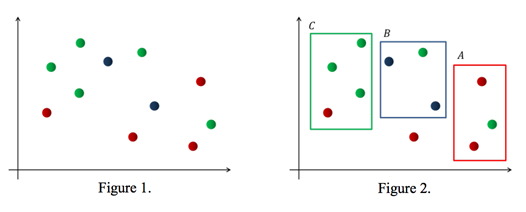

## 문제

Three children A, B, and C play marbles. There are marbles with colors red, blue, and green. At the beginning of the game, the marbles are thrown on the ground, and then they are dispersed.

Each of A, B, and C draws a rectangular area by his hand on the ground. The rectangular areas are closed regions containing their boundaries and all of them should be disjoint with each other. And the sides of the rectangles are axis parallel.

Then the child A counts only the number of red marbles contained in his/her area, B does this for the number of blue marbles, and C does it for the number of green marbles. The number of marbles a child counts in his/her area may be zero. The goal of the game is to maximize the total number of the counted marbles.

Figure 1 shows an example of marbles thrown on the ground. If three rectangular areas are drawn as in Figure 2, then there are 2 red marbles on the A’s area, 2 blue marbles on the B’s area, and 3 green marbles on the C’s area. The total number of the counted marbles is 7 and this is the maximum that can be achieved.

Your program should compute the maximum total number of marbles countable by the children.

## 입력

Your program is to read from standard input. The input consists of T test cases. The number of test cases T is given in the first line of the input. Each test case starts with a line containing three integers, a, b, and c (1 ≤ a, b, c ≤ 10,000), where a, b, and c are the numbers of red, blue and green marbles, respectively. Each of the following a lines contains two integers xi and yi, representing the coordinate (xi, yi) of a red marble (1 ≤ i ≤ a). Each of the following b lines contains two integers xi and yi, representing the coordinate (xi, yi) of a blue marble (a + 1 ≤ i ≤ a + b). And each of the following c lines also contains two integers xi and yi, representing the coordinate (xi, yi) of a green marble ( a + b + 1 ≤ i ≤ a + b + c ). Here, 0 ≤ xi, yi ≤ 10,000,000. Note that the locations of marbles satisfy the condition that at most one marble can be located on any horizontal or vertical line in the plane.

## 출력

Your program is to write to standard output. Print exactly one line for each test case. The line should contain the maximum total number of the counted marbles.
