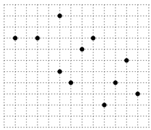
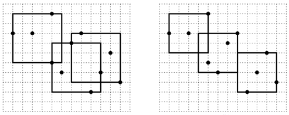

## 문제

철승이는 사물을 좌표계로 생각하기를 좋아한다. 어느 날 집안에 파리가 앉았던 벽의 위치마다 점을 찍고있던 철승이는 엄마에게 등짝 스매싱을 맞는다.

철승이네 집의 벽은 한 변이 1cm인 정사각형의 패턴이 그려진 벽지로 도배되어 있으며, 똑똑한 파리는 이 패턴 정사각형의 모서리에만 앉았다.

< 파리가 앉은 예시 >

새로운 벽지로 모든 점들을 덮으려고하던 철승이는 갑자기 궁금증이 생겼다. 정사각형 모양의 벽지조각 3개만 사용해서 모든 점들을 가린다고 하면 조각의 한 변은 최소 몇 cm이어야 할까?

크기가 똑같고, 벽지와 같은 무늬의 정사각형 종이 3장으로 모든 점들을 가린다고 할 때에 한 종이의 변은 최소 몇 cm인지 계산해보자. 벽지는 깔끔하게 다시 도배해야 하므로 모든 종이는 정확히 정사각형 패턴들과 모서리가 일치해야한다. 종이의 모서리나 면 끝과 점한 점은 가려졌다고 가정한다.

아래의 예제는 정사각형 종이 3장으로 위의 점들을 가리는 경우들을 보여준다.

두 경우에서 오른쪽의 방법이 종이가 더 작으므로 더 좋은 방법이 된다. 철승이의 궁금증을 풀어주기 위해 최소의 벽지 조각의 크기를 계산하자.

모든 종이의 크기는 정수여야하며, 한 점만 가리는 종이(크기가 0인)가 있을 수 있다. 세 종이의 크기는 모두 동일해야 한다.

## 입력

입력의 첫 줄에는 테스트 케이스의 수 T가 주어진다.

이 후 T개의 테스트 케이스마다, 첫 줄에는 점의 수 n (1 ≤ n ≤ 100,000)이 주어진다.

그 후 n줄에 걸쳐서 점의 위치 xi, yi (-1,000,000,000 ≤ xi, yi ≤ 1,000,000,000) 가 주어진다.

## 출력

각 테스트 케이스마다 한 줄에 최소의 종이조각의 크기를 정수로 출력하시오. 단, 종이조각의 크기는 0이 될 수 있음에 유의하시오.
