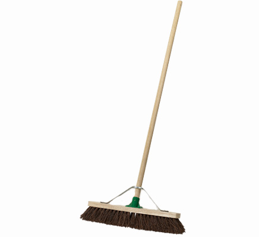

## 문제

Preoccupied with coding, you've allowed your room to become quite dusty. You'd better sweep it before your parents find out!

Your room can be represented by a two-dimensional grid of cells, with *N* rows and *M* columns. Each cell either contains a piece of furniture, or is empty and must be swept. At least one cell is empty.

To get the job done, you'll be using a broom, of course - in particular, a linear broom. A linear broom of length *X* can cover a vertical line of *X* consecutive cells. One sweep of the broom consists of placing it down, and then moving it horizontally by any distance. However, at all times during a sweep, the broom must remain entirely within the boundaries of the room, and all *X* of the cells it covers must be empty. All of the cells that the broom moves over during a sweep are then rid of dust.

The bigger the better, so you'd like to purchase a broom of the largest size possible such that it's possible to sweep your entire room with it. Your room is completely swept once every empty cell has been involved in at least one sweep of the broom. After deciding on the size of your broom, you'd also like to minimize the number of sweeps required to get the job done.

## 입력

The first line of input contains three integers *N* *M* and *F*, which are the number of rows, columns and pieces of furniture respectively (1 ≤ *N* ≤ 2 000; 1 ≤ *M* ≤ 2 000; 1 ≤ *F* < *NM*).

The next *F* lines contain values *r c* (1 ≤ *r* ≤ *N*, 1 ≤ *c* ≤ *M*) which is the row and column position of one piece of furniture. No two pieces of furniture will be at the same coordinates.

## 출력

The output is composed of two numbers.

The first line contains the integer width of the largest broom that can be purchased. The second line contains the number of sweeps required to sweep all empty cells.
