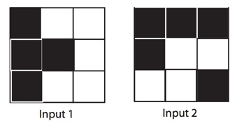

## 문제

당신에게 3x3 크기의 보드가 주어진다. 각각의 칸은 처음에 흰색 혹은 검은색이다. 만약 당신이 어떤 칸을 클릭한다면 당신이 클릭한 칸과 그 칸에 인접한 동서남북 네 칸이 (존재한다면) 검은색에서 흰색으로, 혹은 흰색에서 검은색으로 변할 것이다.

당신은 모든 칸이 흰색인 3x3 보드를 입력으로 주어지는 보드의 형태로 바꾸려고 한다. 보드를 회전시킬수는 없다.

Figure D.1: 예제 입력

## 입력

첫 줄에는 테스트 케이스의 숫자 P(0 < P ≤ 50)이 주어진다.

각각의 테스트 케이스에 대해서 세 줄에 걸쳐 한 줄에 세 글자씩이 입력으로 들어온다. "\*"은 검은색을 뜻하며 "."은 흰색을 뜻한다.

## 출력

각각의 테스트 케이스에 대해서 흰 보드를 입력에 주어진 보드로 바꾸는 데 필요한 최소 클릭의 횟수를 구하여라.
