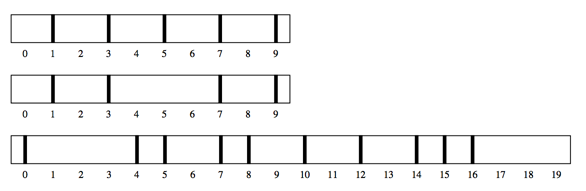

## 문제

Going to circus college is not as fun as you were led to believe. You are juggling so many classes. Trapeze class is sometimes up, sometimes down. There’s a lot of tension in your high-wire class. And you’ve seen that lion taming can be cat-astrophic.

The one pleasure you find is in riding unicycles with your fellow classmates. Many people have unicycles with different sized wheels. One day you notice that all their tires leave a small mark on the ground, once per rotation. You decide to amuse yourself and avoid your classwork by trying to determine how many unicycles have passed by on a given stretch of road. In fact, you want to know the minimum number of unique unicycles that could have left the marks you observe. You make the simplifying assumption that any unicycle riding on the road will ride completely from the beginning to the end.

The figures below illustrate the sample input. Each thick black vertical stripe represents a mark left by a tire.

## 입력

Each line of input represents the observations on a stretch of road. A line begins with two integers 1 ≤ m ≤ 100 and 1 ≤ n ≤ 10, where m represents the length of the road and n represents the number of marks you observe on the road. These are followed by n unique integers a1, a2, . . . , an, where 0 ≤ ai < m for all ai. These n integers represent the positions where you observed a unicycle’s tire has left a mark. There will be at most 100 lines of input. Input ends at end of file.

## 출력

For each set of observations, print the minimum number of unicycles that could have produced the observed marks.
