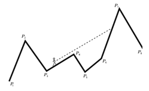

## 문제

You travel through a scenic landscape consisting mostly of mountains – there are n landmarks (peaks and valleys) on your path. You pause for breath and wonder: which mountain are you currently seeing on the horizon?

Formally: you are given a polygonal chain P1P2 . . . Pn in the plane. The x coordinates of the points are in strictly increasing order. For each segment PiPi+1 of this chain, find the smallest index j > i, for which any point of PjPj+1 is visible from PiPi+1 (lies strictly above the ray PiP→i+1).

## 입력

The first line of input contains the number of test cases T. The descriptions of the test cases follow:

The first line of each test case contains an integer n (2 ≤ n ≤ 100 000) – the number of vertices on the chain.

Each of the following n lines contains integer coordinates xi, yi of the vertex Pi (0 ≤ x1 < x2 < . . . < xn ≤ 109; 0 ≤ yi ≤ 109).

## 출력

For each test case, output a single line containing n−1 space-separated integers. These should be the smallest indices of chain segments visible to the right, or 0 when no such segment exists.
