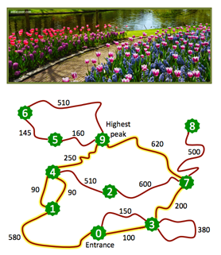

## 문제

In order to attract more visitors, the manager of a national park had the idea of planting flowers along both sides of the popular trails, which are the trails used by common people. Common people only go from the park entrance to its highest peak, where views are breathtaking, by a shortest path. So, he wants to know how many metres of flowers are needed to materialize his idea.

For instance, in the park whose map is depicted in the figure, common people make only one of the three following paths (which are the shortest paths from the entrance to the highest peak).

* At the entrance, some start in the rightmost trail to reach the point of interest 3 (after 100 metres), follow directly to point 7 (200 metres) and then pick the direct trail to the highest peak (620 metres).
* The others go to the left at the entrance and reach point 1 (after 580 metres). Then, they take one of the two trails that lead to point 4 (both have 90 metres). At point 4, they follow the direct trail to the highest peak (250 metres).

Notice that popular trails (i.e., the trails followed by common people) are highlighted in yellow. Since the sum of their lengths is 1930 metres, the extent of flowers needed to cover both sides of the popular trails is 3860 metres (3860 = 2 × 1930).

Given a description of the park, with its points of interest and (two-way) trails, the goal is to find out the extent of flowers needed to cover both sides of the popular trails. It is guaranteed that, for the given inputs, there is some path from the park entrance to the highest peak.

## 입력

The first line of the input has two integers: P and T. P is the number of points of interest and T is the number of trails. Points are identified by integers, ranging from 0 to P − 1. The entrance point is 0 and the highest peak is point P − 1.

Each of the following T lines characterises a different trail. It contains three integers, p1, p2, and l, which indicate that the (two-way) trail links directly points p1 and p2 (not necessarily distinct) and has length l (in metres).

Integers in the same line are separated by a single space.

## 출력

The output has a single line with the extent of flowers (in metres) needed to cover both sides of the popular trails.
