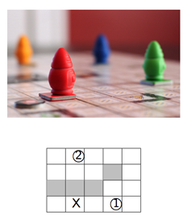
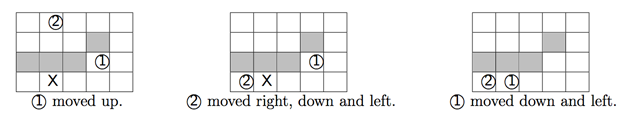

## 문제

A team of up-to four robots is going to deliver parts in a factory floor. The floor is organized as a rectangular grid where each robot ocupies a single square cell. Each robot is represented by an integer from 1 to 4 and can move in the four orthogonal directions (left, right, up, down). However, once set in motion, a robot will stop only when it detects a neighbouring obstacle (i.e. walls, the edges of the factory or other stationary robots). Robots do not move simultaneously, i.e. only a single robot moves at each time step.

The goal is to compute an efficient move sequence such that robot 1 reaches a designed target spot; this may require moving other robots out of the way or to use them as obstacles for “ricocheting” moves.

Consider the example given above, on the right, where the gray cells represent walls, X is the target location and 1 , 2 mark the initial positions of two robots. One optimal solution consists of the six moves described below.

Note that the move sequence must leave robot 1 at the target location and not simply pass through it (the target does not cause robots to stop — only walls, edges and other robots).

Given the description of the factory floor plan, the initial robot and target positions, compute the minimal total number of moves such that robot 1 reaches the target position.

## 입력

The first line contains the number of robots n, the width w and height h of the factory floor in cells, and an upper-bound limit ℓ on the number of moves for searching solutions.

The remaining h lines of text represent rows of the factory floor with exactly w characteres each representing a cell position:

* W a cell occupied by a wall;
* X the (single) target cell;
* 1,2,3,4 initial position of a robot;
* ’.’ an empty cell.

## 출력

The output should be the minimal number of moves for robot 1 to reach the target location or NO SOLUTION if no solution with less than or equal the given upper-bound number of moves exists.
