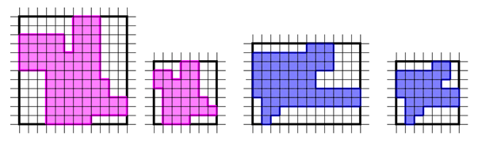

## 문제

Dynamic geometry software can help students understand transformation geometry as it allows to visualize the effect of transformations on a shape. Alice is learning the elementary transformations – slides, flips and turns – or, more formally, translations, reflections and rotations. Today she is exploring slides and turns. She is working with simple rectlinear polygons drawn on a regular square grid. Each polygon has at most one edge per grid line and its vertices are grid points.

She knowns that: a rectilinear polygon is a polygon whose edges meet at right angles; in a simple polygon the edges meet only at their endpoints; the vertices are the points where edges meet; the region delimited by a rectilinear polygon embedded on a grid corresponds to a polyomino (formed by unit squares); a permutomino is a polyomino that has exactly one edge on all the grid lines that intersect its minimum bounding rectangle; that rectangle is actually a square (for an n-vertex permutomino, it intersects n/2 horizontal and vertical grid lines). Her teacher has explained how slides and turns act on point coordinates but, by that time, Alice was already thinking about an episode of “The Sympsons” in which Homer claimed that there was no more room in his brain for more information.

Now, she has to decide whether two simple rectlinear polygons, without collinear edges, can be transformed to the same permutomino by slides and turns, under some restricted rules. The two polygons are handled as independent instances, as if they were in different grids. First, she must remove the empty grid lines from the minimum bounding rectangle to obtain a permutomino. This is done by sliding some edges to the left or downwards, in such a way that the relative order of the edges is preserved (i.e., they will occur in the same order as before if we sweep the plane using a vertical or a horizontal line). Once she gets the permutomino, she can apply a rotation by 90 degrees clockwise around the center of its minimum bounding square, the number of times she wishes.

Can we give the answer to Alice’s problem, for a pair of such polygons?

## 입력

The first line contains the description of the first rectilinear polygon: the number of vertices followed by their coordinates in a canonical cartesian system. The sequence of vertices is given in counterclockwise order (CCW) and starts at the leftmost vertex on the bottom horizontal edge. The last vertical edge is defined by the last vertex and the first one in the sequence. The bottom-left corner of the minimum bounding rectangle is always (0,0). The next line contains a similar description for the other rectilinear polygon. The number of vertices of the two polygons may be different. (The image illustrates Sample 1.)

For each polygon: the number of vertices is even and between 4 and 500; the coordinates (x, y) of each vertex satisfy 0 ≤ x ≤ 3 000 and 0 ≤ y ≤ 3 000.

## 출력

A line containing the answer yes or no.
