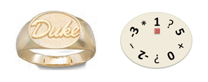

## 문제



One of the brightest and richest dukes of the nineteenth century built a break-in-proof room for storing his valuables and chose the lock secret code in an ingenious manner. He was so afraid of being robbed that he did not tell anyone the safe secret; he only wrote the way to obtain it on a piece of paper, to be given to his heir on his death.

1. Look at the bottom of my dukedom ring, which is now yours.
2. Write down the numbers and symbols, following a clockwise order, starting at the number closest to the ruby and leaving out the last symbol. That is the first sequence of numbers and symbols. Do the same starting at the next number, with respect to the clockwise order. That is the second sequence of numbers and symbols. Repeat this process, always starting at the next number, until you have started at all numbers. Now you have several sequences of numbers and symbols.
3. For each of those sequences of numbers and symbols, do the following.
   1. Replace every ? by a +, a − or a ∗ symbol. Do that in all possible ways to have several arithmetic expressions.
   2. Evaluate each of those arithmetic expressions, performing the sums, the differences and the products in any order. Do that in all possible ways to have several values.
   3. Select the minimum and the maximum of those values.
   4. Write the digits of the minimum value and append to them the digits of the maximum value. That is the code of the sequence of numbers and symbols.
4. Concatenate the codes of all sequences of numbers and symbols, respecting the order in which you have obtained the sequences. That sequence of digits is the safe secret.

When the duke passed away, his son read the note and tried to find out the safe secret. The first two steps were very easy, because there were only five sequences of numbers and symbols, obtained in the following order:

```

1 ? 5 + 0 ? -2 − -3
5 + 0 ? -2 − -3 ∗ 1
0 ? -2 − -3 ∗ 1 ? 5
-2 − -3 ∗ 1 ? 5 + 0
-3 ∗ 1 ? 5 + 0 ? -2
```

Then, he moved to the third step and chose to begin with the first sequence of numbers and symbols. Difficulties started in point (a) when he realised that he could create several arithmetic expressions, such as:

1 + 5 + 0 + -2 − -3, 1 − 5 + 0 ∗ -2 − -3, and 1 ∗ 5 + 0 − -2 − -3.

So, he decided to understand the remaining rules before completing this task. In point (b), he had to evaluate the arithmetic expressions. It seemed easy. The value of 1 + 5 + 0 + -2 − -3 was 7. But how many different values could he get from 1 − 5 + 0 ∗ -2 − -3?

* If the operations were performed from left to right, ((((1 − 5) + 0) ∗ -2) − -3), the result would be 11.
* If the operations were performed from right to left, (1 − (5 + (0 ∗ (-2 − -3)))), the result would be -4.
* If the first difference and the product were performed first, (1 − 5) + (0 ∗ -2) − -3, the result would be -1.
* And there were so many other alternatives!

Almost in despair, he concluded that he had to obtain a huge number of values in the third step. Fortunately, the last rules were actually simple. If -4 was the minimum of the values obtained from the first sequence and 11 was the maximum, the code of the first sequence would be 411. Besides, if the second sequence code was 512, the third sequence code was 613, the fourth sequence code was 714, and the fifth sequence code was 815, the safe secret would be 411512613714815.

Although the duke’s son spared no effort in finding the secret, he has never achieved that goal. In fact, no one has managed to open the safe so far. Now that the palace will be transformed into a museum, could you help unveiling the treasure?

Given the sequence of numbers and symbols obtained from the dukedom ring, starting at the number closest to the ruby, following a clockwise order, and including the last symbol, the goal is to find out the safe secret. It is guaranteed that, for the given inputs, any value obtained by the process described above fits in a normal signed 64 bit integer.

## 입력

The first line of the input has one positive integer, k, which is the number of pairs (number, symbol) that form the sequence.

The following line contains 2k elements, n1, s1, n2, s2, . . . , nk, sk, separated by a single space, where ni denotes a number and si denotes a symbol that is +, −, ∗, or ? (for every i = 1, 2, . . . , k).

## 출력

The output has a single line with the safe secret.
