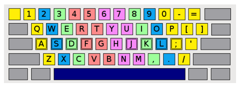

## 문제

Proper typing is becoming an essential part of culture. If you are still not using all ten fingers for typing, you have to re-learn typing – then you will type faster and feel more comfortable and enjoyable.

There are a lot of web sites teaching proper typing. The following image depicts the basic principle; the keys needed to press with the same finger are of the same color. The yellow keys need to be pressed with the pinky, the blue ones with the ring finger, the green ones with the middle finger and the red ones with the index finger. Naturally, the left hand presses the left side of the keyboard (starting with keys 5, T, G, B to the left), the right hand presses the right side (starting with keys 6, Y, H, N to the right). Thumbs are responsible for space.

Please note: the image depicts the US layout. For programming purposes, it is advised to switch to this layout because a lot of special characters, like [], are easier to type. The US layout can be easily set on any operation system.

Your task is to output how many times each finger, excluding thumbs, participated in typing the given string properly.

## 입력

The first and only line of input contains of a string consisting of at least one and at most fifty characters. The string doesn’t contain whitespaces and consists only of characters depicted on the image above.

## 출력

The output must consist of eight lines, in each line one integer denoting the number of presses of each finger, excluding thumbs, observed from left to right.
