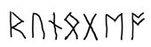

## 문제

You are helping an archaeologist decipher some runes. He knows that this ancient society used a Base 10 system, and that they never start a number with a leading zero. He’s figured out most of the digits as well as a few operators, but he needs your help to figure out the rest.

The professor will give you a simple math expression. He has converted all of the runes he knows into digits. The only operators he knows are addition (+), subtraction (-), and multiplication (\*), so those are the only ones that will appear. Each number will be in the range from −999, 999 to 999, 999, and will consist of only the digits ‘0’–‘9’, possibly a leading ‘-’, and a few ‘?’s. The ‘?’s represent a digit rune that the professor doesn’t know (never an operator, an ‘=’, or a leading ‘-’). All of the ‘?’s in an expression will represent the same digit (0–9), and it won’t be one of the other given digits in the expression.

Given an expression, figure out the value of the rune represented by the question mark. If more than one digit works, give the lowest one. If no digit works, well, that’s bad news for the professor—it means that he’s got some of his runes wrong. Output −1 in that case.

## 입력

The sample data will start with the number of test cases T (1 ≤ T ≤ 100). Each test case will consist of a single line, of the form:

[number][op][number]=[number]

Each [number] will consist of only the digits ‘0’-‘9’, with possibly a single leading minus ‘-’, and possibly some ‘?’s. No number will begin with a leading ‘0’ unless it is 0, no number will begin with -0, and no number will have more than 6 characters (digits or ?s). The [op] will separate the first and second [number]s, and will be one of: +, - or \*. The = will always be present between the second and third [number]s. There will be no spaces, tabs, or other characters. There is guaranteed to be at least one ? in every equation.

## 출력

Output the lowest digit that will make the equation work when substituted for the ?s, or output −1 if no digit will work. Output no extra spaces or blank lines.
