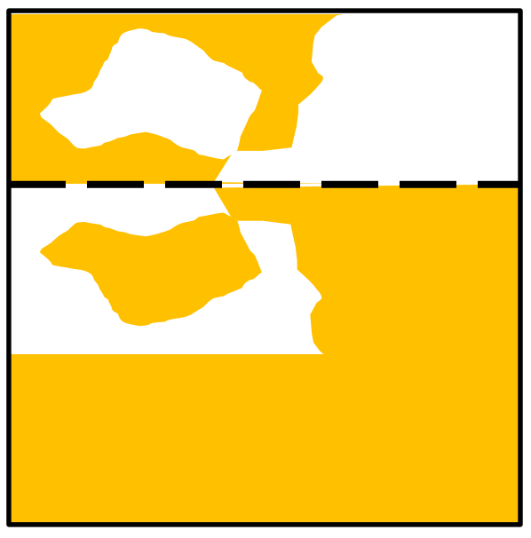

## 문제

Gold leaf is a very thin layer of gold with a paper backing. If the paper gets folded and then unfolded, the gold leaf will stick to itself more readily than it will stick to the paper, so there will be patches of gold and patches of exposed paper. Note that the gold leaf will always stick to itself, rather than the paper. In the following example, the paper was folded along the dashed line. Notice how the gold leaf always sticks to one side or the other, never both.

Consider a crude digital image of a sheet of gold leaf. If the area covered by a pixel is mostly gold, that will be represented by a ‘#’. If it’s mostly exposed paper, it will be represented by a ‘.’. Determine where the sheet was folded. The sheet was folded exactly once, along a horizontal, vertical, or 45 degree diagonal line. If the fold is horizontal or vertical, it is always between rows/columns. If the fold is diagonal, then the fold goes through a diagonal line of cells, and the cells along the fold are always ‘#’.

## 입력

Input will start with a single line containing the number of cases, between 1 and 100, inclusive. Each test case will begin with a line with two integers, N and M 2 ≤ N, M ≤ 25, where N is the number of rows, and M is the number of columns of the photograph. Each of the next N lines will contain exactly M characters, all of which will be either ‘#’ or ‘.’. This represents a crudely represented digital image of the sheet of gold leaf. There is guaranteed to be at least one ‘.’, and there is guaranteed to be a solution.

## 출력

For each test case, output four integers, indicating the places where the fold hits the edges of the paper. Output them in the order r1 c1 r2 c2 where (r1,c1) and (r2,c2) are row/column coordinates (r=row, c=column). The top left character is (1,1) and the bottom right is (n,m). If the fold is horizontal or diagonal, list the left side coordinates before the right. If the fold is vertical, list the top coordinates before the bottom. If the fold is horizontal, use the coordinates above the fold. If the fold is vertical, use the coordinates to the left of the fold. If the fold is diagonal, use the coordinates of the cells that the fold goes through. If more than one fold is possible, choose the one with the smallest first coordinate, then the smallest second coordinate, then third, then fourth.
