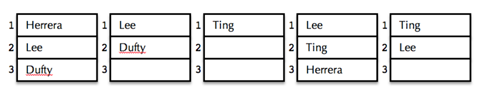
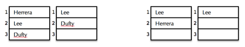

## 문제

Ranked choice voting—also known as instant runoff voting—is used in San Francisco and Oakland for mayoral elections. Rather than voting for a single candidate, those casting ballots vote for up to three candidates, ranking them 1, 2, and 3.

The first five of what might be tens or even hundreds of thousands of ballots in a real election might look like this:



Initially, only first place votes matter, and if a single candidate gets the clear majority of all first place votes, then that candidate wins. Rarely would anyone get a majority of all first place votes (there were, for instance, 16 official candidates in San Francisco’s mayoral election on November 8th, 2011, and Ed Lee, who eventually won, only got 31% of the first choice votes.) In that case, the candidates with the least number of first place votes are eliminated by effectively removing them from all ballots everywhere and promoting all second and third place votes to be first and second place votes to close out any gaps.

If, for example, after an analysis of all ballots, it’s determined that Phil Ting received the smallest number of first place votes, the ballots would be updated to look like this:



The first two ballots were left alone, but the next three were updated to reflect Phil Ting’s elimination. The one ballot including a standalone vote for Phil Ting was removed, since it no longer contains any valid votes. The two other impacted ballots shown each show candidates Dennis Herrera and Ed Lee advance from third to second and second to first, respectively.

The process is repeated over and over again until it leaves one candidate with a majority of first choice votes. (On November 8th, 2011, this process was applied 12 times before Ed Lee prevailed with 61% of all remaining rank-one votes and was declared the winner of the San Francisco mayoral race.) If the final round sees a two-way tie between the two remaining candidates [or a three-way tie between the three remaining candidates, and so forth], then no winner is declared.

## 입력

The first line contains an integer between 1 and 100, inclusive, giving the number of test cases. Each test case leads with a single integer between 1 and 100000, which specifies how many ballots need to be processed. Each ballot is expressed as a string of capital letters, where each letter represents a single candidate. Ballot string can be of length 1, 2, 3 to denote up to three votes, and you can assume no ballot ever contains more than one vote for any particular candidate. The first character of the string reflects the voter’s first choice. The second character, if present, represents the voter’s second choice. The third character, if present, represents the voter’s third choice.

## 출력

For each input scenario, publish a single line summarizing exactly how candidates were eliminated. If a winner can be declared immediately (i.e. a candidate has a clear majority without eliminating anyone), then simply print the capital letter for that candidate on its own line, as with:

```

A
```

If one or more elimination rounds are needed, then a summary of the elimination process should look like this:

```

EF -> D -> C -> B
```

The above line reflects the fact that three elimination rounds were needed to arrive at a winner. The above line conveys the understanding that candidates E and F were eliminated during the first round, candidate D was eliminated during a second round, and candidate C was eliminated during a third round before B was declared the winner. When multiple candidates are eliminated in the same round, they must be listed in alphabetic order. [There is exactly one space between visible characters, and there are no trailing spaces at the end of any line.]

It’s possible a series of elimination rounds leaves the election in a stalemate, because all remaining candidates have an equal number of first-choice votes. In that case, all remaining candidates incidentally tie for the least number of first-choice votes and are collectively eliminated, leaving no candidates and no clear winner. In that case, the summary would look as follows:

```

DE -> A -> BCF -> no winner
```

The above conveys that two elimination rounds led to a three-way tie between candidates B, C, and F, all of whom were eliminated in a third round that left all ballots empty.
