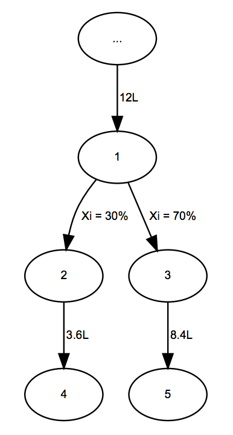

## 문제

Little Bobi gets up every morning and feeds his favourite pets: ants. He keeps them in a terrarium with a pipe system that can be represented as a tree with N nodes. The pipes are represented by the edges of the tree. The root of the tree is located at node denoted with 1. Inside the pipe system, the liquid flows from a node to its children because of gravity.

We know the flow Xi of each pipe: the percent of fluid from the parent node that flows through that pipe to the child node. Let’s observe the following example:

Node 1 from the image has 12 liters of liquid in it and has two pipes after it. One has the flow of Xi = 30, and the other Xi = 70. Node 2 is going to get 3.6 liters and node 3 gets 8.4 liters. In the input data, the sum of flows of pipes going from the same node will always be equal to 100.

Some of Bobi’s pipes aren’t just regular pipes; they are a bit strange. They are super pipes that have the superpower to squaretheamount of liquid flowing through them. In the previous example, if the first pipe has the superpower, node 2 gets 12.96 liters and node 3 still gets only 8.4 liters. Notice now that a node has more liquid leaving it than the amount entering it. This is exactly the reason why these pipes are super pipes!

All super pipes can have their superpower turned on or off by Bobi.

The ants live only in the leaves of the tree (nodes that don’t have any children). For each leaf we know the required amount of liquid Ki to feed all ants living in that leaf. Bobi wants to feed his ants by pouring L liters of liquid into the root of the tree. He doesn’t have much money so he wants to know the minimum amount of liters of liquid he needs to buy to keep all of his ants fed.

Please note: The input data is such that the required number L will not exceed 2 · 109.

## 입력

The first line of input contains the integer N (1 ≤ N ≤ 1000). Each of the following N − 1 lines contain four integers Ai, Bi, Xi, Ti (1 ≤ Ai, Bi ≤ N, 1 ≤ Xi ≤ 100, 0 ≤ Ti ≤ 1) where Ai and Bi are the ends of a pipe (the labels of nodes connected by the pipe), Xi is the flow of the liquid through the pipe, and Ti denotes whether the pipe has a superpower. If Ti is 1, that pipe has a superpower, otherwise it does not.

The following line contains N integers Ki describing the amount of liquid needed for the ants in the ith node. If the ith node is not a leaf, Ki will be -1, otherwise it will be an integer from the interval [1, 10].

## 출력

The first and only line of output must contain the required number from the task.

Please note: The allowed absolute error from the correct (precise) solution is 0.001.

## 힌트

Clarification of the first example: If Bobi pours 8 liters of liquid into the root of the tree, node 3 will get 4 liters, node 4 will get 1 liter and node 5 will get 9 liters. These nodes are leaves (they have ants in them) and this is the exact minimum amount the ants need to get. Also, 8 liters is the minimum amount of liquid that satisfies the “ant” conditions.
