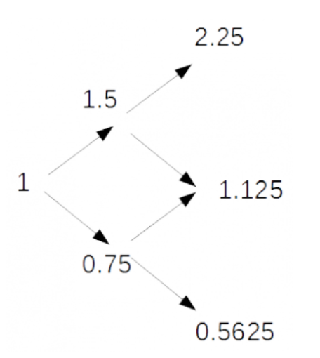

## 문제

Starting with one dollar of capital, a gambler chooses a fixed proportion, F, of his capital to bet on a fair coin toss repeatedly for T tosses.

His return is double his bet for heads and he loses his bet for tails.

For example, if F=1/4, for the first toss he bets 0.25\$, and if heads comes up he wins 0.5\$ and so then have 1.5\$. He then bets 0.375\$ and if the second toss is tails, he has 1.125\$ left.

The diagram on the right shows the possibilities in two coin tosses. If both times head comes, his worth is 2.25\$, if one head and one tail comes in either order, his worth is 1.125\$, and in case it is tails both times, he is left with 0.5625\$. All four cases are equally probable. The expected worth of the one dollar gambler is therefore 1.265625 after a two toss game.

Your task in this problem is to find the expected worth of the one dollar gambler given F, the fraction of current worth to bet on the next toss and T, the total number of coin tosses.

## 입력

The input consists of multiple test cases. The first line of input is the number of test cases N (1≤N≤100). Each of the following N lines contains a float point number F (0≤F≤1), the fraction of current worth to bet and T (1≤T≤100), the number of coin tosses.

## 출력

For each test case, print a single line saying “Case #n:” where n is the test case number followed by a space followed by the expected worth of the one dollar gambler. Small absolute or relative errors(10-6) are acceptable in the output.
