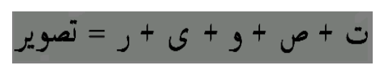
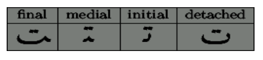

## 문제

The Urdu language is written in the Nastaleeq or Naskh writing styles. It is written from right to left and top to bottom. The particularity of these writing styles is that the form of a particular letter depends on its place in the word.

For example, the Urdu word for “picture”, transliterated into roman is “tasviir”. Here, reading from right to left, we see the component letters in their detached form (ta s v ii r) and how they are put together as a word:

This example illustrates that each letter has a detached form (on the right), as well as up to three more forms: initial, medial and final. For example, the first letter, “ta” has an initial form that we see at the start of the word. For the next letter, as it is placed between two consonants, its medial form needs to be used. Similar logic applies to the third letter in the word. The medial form of this letter, “vaow”, is used. The fourth letter, “yay” is preceded by one of the two special vowels in Urdu, “alif” and “vaow”. These letters are special in the sense that the following letter must appear in its initial form (rather than its medial or final form). Hence, the fourth letter, “cchoTi yay” appears in its initial form despite the fact that it is not the first letter of the word. The fifth letter, “ray”, being the last letter in the word, appears in its final form:

The following table illustrates all the forms of the first letter in our word:

Your task is to validate a sequence of Urdu letters, each in a certain form, and indicatewhether the word is correctly written.

For use in this problem, the 38 letters of the alphabet have been coded from 1 through to 38, so that the first letter is represented by 1, the second by 2 and so on through to the last letter represented by 38. Similarly, the four possible forms of a letter, detached, initial, medial and final are encoded as detached – 0, initial – 1, medial – 2, final – 3. To represent a letter in a particular form we will multiply the letter code by 4 and add the form code to it.

Here is a summary of the validation rules.

The first letter of a word, as well as the first letter after special vowel (letter codes 1 and 33 in any form) should always be in the initial form.  
If a letter is followed by another (and as long as it is not preceded by the special vowels – see rule #1), it should be in medial form.  
The last letter should be in the final form, unless the preceding letter is a special vowel. In that case, last letter should be in detached form.

## 입력

The input consists of multiple test cases. The first line of input is the number of test cases N (1≤N≤100). Each of the following N lines contains an integer M (1≤M≤20) followed by M encoded Urdu letters of a single Urdu word according to the encoding given above.

## 출력

For each test case, print a single line that says "Case #n: " where n is the test case number followed by a space and the word “Yes” if correct letter forms have been used and the word “No” if incorrect letter forms have been used.
