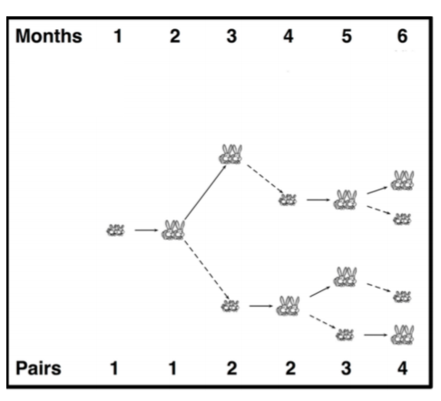

## 문제

A hypothetical population of rabbits follows certain fixed rules.

1. The population begins in the first month with a pair of newborn rabbits.
2. Rabbits reach reproductive age in one month.
3. In any month, every rabbit of reproductive age mates with another rabbit of reproductive age.
4. One month after two rabbits have mated, the female rabbit gives birth to a male and female rabbit.
5. Rabbits die after a given age of D months and not reproducing after R months where R ≤ D.

In the figure on the right, a depiction of a rabbit tree is shown in which rabbits live for three months (meaning that they reproduce only twice before dying). The life of a particular rabbit pair is shown with solid arrows. For example the initial pair starts their life in Month 1, mates in month 2 and a new pair is born in month 3 as a result (the dotted arrow). The original pair mates again in month 3, and a new pair is born in month 4 (dotted arrow). However the original pair dies in month 4 right after giving birth and is therefore not shown in the population of month 4.

## 입력

The input consists of multiple test cases. The first line of input is the number of test cases N (1≤N≤100). Each of the following N lines contains positive integers D≤100, R≤100, and M≤20 where D is the number of months after which a rabbit dies, R is the number of month after which a rabbit stops reproducing, and M is the number of months to model.

## 출력

For each test case, print a single line saying “Case #n:” where n is the test case number followed by a space followed the total number of rabbit pairs that will remain after M months.
