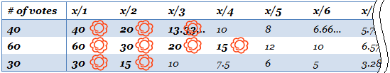

## 문제

An election selecting the members of the parliament in JAG Kingdom was held. The only system adopted in this country is the party-list proportional representation. In this system, each citizen votes for a political party, and the number of seats a party wins will be proportional to the number of votes it receives. Since the total number of seats in the parliament is an integer, of course, it is often impossible to allocate seats exactly proportionaly. In JAG Kingdom, the following method, known as the D'Hondt method, is used to determine the number of seats for each party.

Assume that every party has an unlimited supply of candidates and the candidates of each party are ordered in some way. To the \(y\)-th candidate of a party which received \(x\) votes, assign the value \(\dfrac{x}{y}\). Then all the candidates are sorted in the decreasing order of their assigned values. The first \(T\) candidates are considered to win, where \(T\) is the total number of seats, and the number of seats a party win is the number of its winning candidates.

The table below shows an example with three parties. The first party received \(40\) votes, the second \(60\) votes, and the third \(30\) votes. If the total number of seats is \(T = 9\), the first party will win \(3\) seats, the second \(4\) seats, and the third \(2\) seats.

When selecting winning candidates, ties are broken by lottery; any tied candidates will have a chance to win. For instance, in the example above, if \(T = 5\) then two candidates tie for the value \(20\) and there are two possible outcomes:

* The first party wins \(2\) seats, the second \(2\) seats, and the third \(1\) seat.
* The first party wins \(1\) seat, the second \(3\) seats, and the third \(1\) seat.

You have just heard the results of the election on TV. Knowing the total number of valid votes and the number of seats each party won, you wonder how many votes each party received.

Given \(N\), \(M\), and \(S\_i\) (\(1 \le i \le M\)), denoting the total number of valid votes, the number of parties, and the number of seats the \(i\)-th party won, respectively, your task is to determine for each party the minimum and the maximum possible number of votes it received. Note that for some cases there might be no such situation with the given \(N\), \(M\), and \(S\_i\).

## 입력

The first line of the input contains two integers \(N\) (\(1 \le N \le 10^9\)) and \(M\) (\(1 \le M \le 30{,}000\)), where \(N\) is the total number of valid votes and \(M\) is the number of parties. \(M\) lines follow, the \(i\)-th of which contains a single integer \(S\_i\) (\(0 \le S\_i \le 30{,}000\)), representing the number of seats the \(i\)-th party won. You can assume that there exists \(i\) with \(S\_i \ne 0\).

## 출력

If there is no situation with the given \(N\), (M\), and \(S\_i\), display the word "impossible". Otherwise, output \(M\) lines, each containing two integers. The first integer and the second integer in the \(i\)-th line should be the minimum and the maximum possible number of votes the \(i\)-th party received, respectively.
