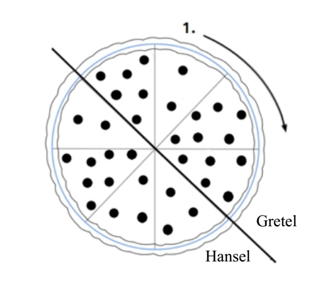

## 문제

After having eaten all the cookies from the wicked witch’s house, Hansel and Gretel ordered a jumbo pizza. The pizza arrived shortly, cut into eight pieces. Hansel and Gretel are going to split the pizza in half so that each of them gets a complete pizza "half-circle" or, in other words, four consecutive pieces.

Gretel really likes mushrooms and wants to get as many as she can. Given the fact that some pizza slices contain less and some more mushrooms, Gretel has asked Hansel to split the pizza so that her pieces contain as many mushrooms as possible.

Help Hansel and Gretel! They will tell you how many mushrooms there are on each of the eight pizza slices, and your job is to find the largest total number of mushrooms Gretel can get. The following image depicts the optimal division for the second test sample below (1. denotes the first slice given in the input data):

## 입력

Each of the eight lines of input contains the integer Si (0 ≤ Si ≤ 50, i = 1, 2, . . . , 8). These numbers are, respectively, the amount of mushrooms on pizza slices, where the slices are given in clockwise order.

## 출력

The first and only line of output must contain the required number.
