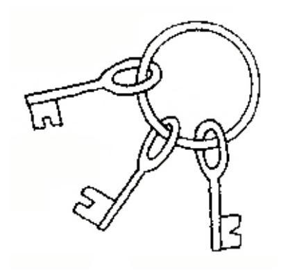

## 문제

The state of the economy is bad, the crysis is striking the country and people are losing their jobs. However, Sisyphus, the main hero of this task, has found himself a new job. Starting next monday, Sisyphus will be an assistant locksmith in a hotel. Naturally, first he needs to demonstrate his locksmithing abilities to the head locksmith.

This is why the head locksmith has given Sisyphus N keys on a big round pendant, blindfolded him and led him into a big room. That room contains N locked doors, denoted with numbers from 1 to N. Each of the keys on the pendant unlocks precisely one door.

Sisyphus’ job is to unlock and lock each door again. He does this in a way that he moves along the wall, not changing direction, until he reaches a door. When he reaches a door, he tries unlocking it using the first (leftmost) key. In the case when the key doesn’t unlock the door, Sisyphus moves it to the other (right) side of pendant and repeats this procedure until he finds the right key. His work is done when he goes through all the doors. The first door Sisyphus unlocked is denoted with 1, the next with 2, the one after with 3 and so on...

What Sisyphus doesn’t know is that the head locksmith is, in fact, testing his endurance so he led him into a circular room. Therefore, Sisyphus will, after unlocking and locking the last door, go unlocking and locking the first door again. Because he’s a hardworking and persistent fellow, Sisyphus has been doing this job for hours and hours without saying a single word. Only after the Kth successful unlocking and locking of a door he spoke: "If only I knew how many times so far I’ve put a wrong key in a door’s lock!" Your task is to answer his question!

## 입력

The first line of input contains the integers N (1 ≤ N ≤ 105) and K (1 ≤ K ≤ 109) from the task.

The ith of the following N lines contains the integer vi (1 ≤ vi ≤ N) which denotes that the ith key on the pendant (from left to right) unlocks the door vi.

## 출력

The first and only line of output must contain an integer representing the answer to Sisyphus’ question.

## 힌트

Clarification of the second example:

* The first locking/unlocking (door 1) – keys (left to right): 4 2 1 3
* The second locking/unlocking (door 2) – keys (left to right): 1 3 4 2
* The third locking/unlocking (door 3) – keys (left to right): 2 1 3 4
* The fourth locking/unlocking (door 4) – keys (left to right): 3 4 2 1
* The fifth locking/unlocking (door 1) – keys (left to right): 4 2 1 3
* The sixth locking/unlocking (door 2) – keys (left to right): 1 3 4 2
* The misplaced keys are underlined.
