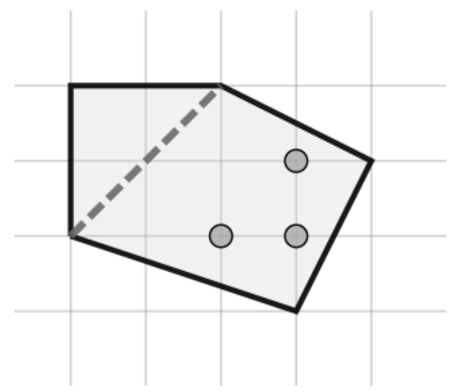

## 문제

병찬이는 친구 공찬이를 위해 맛있는 피자를 시켰다. 하지만 공찬이는 올리브를 싫어해서 피자를 잘라서 먹으려고 한다.

병찬이가 갖고 온 피자는 볼록다각형 모양을 하고 있으며, 올리브는 피자 안에 박혀있다. 공찬이는 피자를 보다 편하게 자르기 위해 인접하지 않은 두 꼭짓점을 선택하여 그 두 꼭짓점을 잇는 직선을 따라 피자를 자른다. 공찬이는 잘린 피자의 두 조각 중 올리브가 없는 쪽을 선택해서 먹을 것이다. 다만, 공찬이가 자르는 직선 위에 올리브가 있는 경우 올리브가 두 갈래로 잘리므로 두 조각 모두 먹지 못한다.

이 그림은 첫 번째 예제의 피자 모양이다. 공찬이가 자른 흔적이 점선으로 남아있다.

병찬이는 피자를 많이 먹지 않기 때문에 공찬이는 자신이 먹을 부분이 최대한 크게 피자를 자르려고 한다. 공찬이를 도와 얼마나 피자를 크게 자를 수 있는지 구하는 프로그램을 작성하여라.

## 입력

첫 번째 줄에는 피자의 꼭짓점의 수 N이 주어진다.

두 번째 줄부터 N개의 줄에는 피자의 각 꼭짓점의 좌표 Xi, Yi가 주어진다. 피자의 꼭짓점은 시계 반대 방향으로 주어진다. 피자에서 만들어지는 N개의 각들은 전부 180도보다 작다.

N+2번째 줄에는 올리브의 수 M이 주어진다.

N+3번째 줄부터 M개의 줄에는 올리브의 좌표 Xi, Yi가 주어진다. 올리브가 피자의 변 위에 있거나 피자 밖에 있는 경우는 존재하지 않으며, 올리브는 매우 작아서 점으로 간주해도 상관없다.

## 출력

만약 공찬이가 피자를 어떻게 자르더라도 두 조각 모두 올리브가 있는 경우 0을 출력한다.

그렇지 않은 경우 공찬이가 먹을 수 있는 피자의 최대 넓이를 2로 곱한 값을 출력한다. 잘 생각해보면, 답은 항상 정수임을 알 수 있다.

## 힌트

예제 2 설명: 공찬이는 피자의 2번 점과 5번 점을 잇는 직선을 따라 피자를 자르면 된다.

예제 3 설명: 공찬이는 피자의 1번 점과 3번 점을 잇는 직선을 따라 피자를 자르면 된다.
