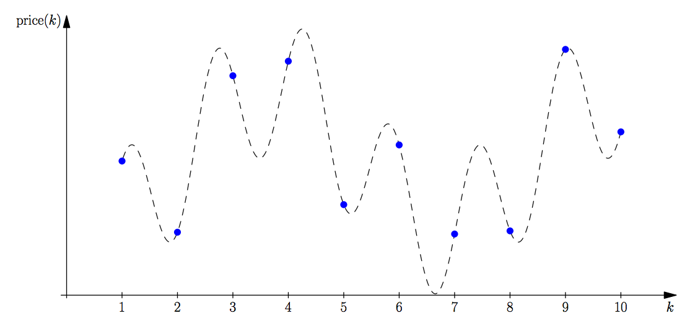

## 문제

Fatima Cynara is an analyst at Amalgamated Artichokes (AA). As with any company, AA has had some very good times as well as some bad ones. Fatima does trending analysis of the stock prices for AA, and she wants to determine the largest decline in stock prices over various time spans. For example, if over a span of time the stock prices were 19, 12, 13, 11, 20 and 14, then the largest decline would be 8 between the first and fourth price. If the last price had been 10 instead of 14, then the largest decline would have been 10 between the last two prices.

Fatima has done some previous analyses and has found that the stock price over any period of time can be modelled reasonably accurately with the following equation:

price(k) = p·(sin(a·k+b) + cos(c·k+d) + 2)

where p, a, b, c and d are constants. Fatima would like you to write a program to determine the largest price decline over a given sequence of prices. Figure A.1 illustrates the price function for Sample Input 1.

You have to consider the prices only for integer values of k.

Figure A.1: Sample Input 1. The largest decline occurs from the fourth to the seventh price.

## 입력

The input consists of a single line containing 6 integers p (1 ≤ p ≤ 1 000), a, b, c, d (0 ≤ a, b, c, d ≤ 1 000) and n (1 ≤ n ≤ 106). The first 5 integers are described above. The sequence of stock prices to consider is price(1), price(2), ... , price(n).

## 출력

Display the maximum decline in the stock prices. If there is no decline, display the number 0. Your output should have an absolute or relative error of at most 10−6.
