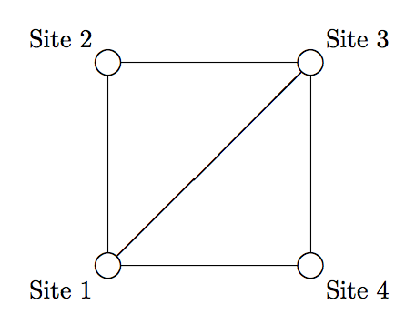

## 문제

The Arca Carania Mountain national park is opening up for tourist traffic. The national park has a number of sites worth seeing and roads that connect pairs of sites. The park commissioners have put together a set of round tours in the park in which visitors can ride buses to view various sites. Each round tour starts at some site (potentially different sites for different tours), visits a number of other sites without repeating any, and then returns to where it started. At least 3 different sites are visited in each round tour. At least one round tour is possible in the national park.

The park commissioners have decided that, for any given road, all buses will be operated by a single company. The commissioners do not want to be accused of favoritism, so they want to be sure that each possible round tour in the park has exactly the same number of roads assigned to each bus company. They realize this may be difficult to achieve. Thus, they want to learn what numbers of bus companies allow for a valid assignment of companies to roads.

Consider Sample Input 1, which is illustrated in Figure K.1. There are a total of three round tours for these sites. Some company is assigned road 1-3. It must also be assigned some road on the round tour 1-2-3-4-1, say 2-3. But then it is assigned to two of the three roads on the round tour 1-2-3-1, and no other company can match this – so there can be no other companies. In Sample Input 2 there is only one round tour, so it is enough to assign the roads of this tour equally between companies.

Figure K.1: Sample Input 1.

## 입력

The first line of input contains two integers n (1 ≤ n ≤ 2 000), which is the number of sites in the park, and m (1 ≤ m ≤ 2 000), which is the number of roads between the sites. Following that are m lines, each containing two integers ai and bi (1 ≤ ai < bi ≤ n), meaning the sites ai and bi are connected by a bidirectional road. No pair of sites is listed twice.

## 출력

Display all integers k such that it is possible to assign the roads to k companies in the desired way. These integers should be in ascending order.
