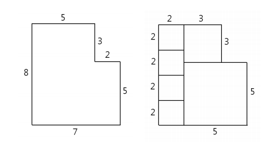
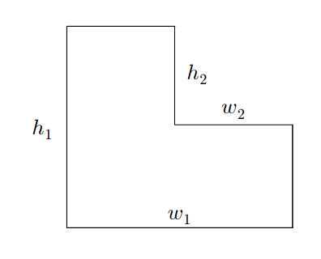

## 문제

각 변의 길이가 양의 정수이고 영문자 L 모양인 종이가 주어져 있다. 이 종이를 칼로 여러 번 잘라서 모든 조각이 한 변의 길이가 양의 정수인 정사각형이 되도록 하고자 한다.

칼로 종이를 자르는 규칙은 다음과 같다.

1. 자르는 방향은 수직 또는 수평만 허용된다. 즉, 사선으로는 자를 수 없다.
2. 자르는 도중 칼의 방향을 바꿀 수 없다.
3. 자르는 도중에 칼을 멈출 수 없다. 즉, 일단 어떤 조각을 자르기 시작하면 그 조각이 반드시 둘로 분리될 때 까지 자른다.
4. 잘려진 조각의 각 변의 길이는 양의 정수이어야 한다.

위의 규칙에 따라 주어진 L 모양의 종이를 잘라 각 조각이 정사각형이 되도록 하되, 잘려진 조각 개수가 최소가 되도록 하고자 한다.

예를 들어, 각 변의 길이가 아래 왼쪽 그림에서 보인 것과 같은 종이가 주어질 때, 최소 개수의 정사각형 조각을 얻도록 자른 결과를 아래 오른쪽 그림에서 보였다.

L 모양의 종이를 제시한 규칙에 따라 잘랐을 때, 잘려진 조각의 개수가 최소가 되도록 하는 프로그램을 작성하시오.

## 입력

L모양 종이의 각 변의 길이에 관한 정보를 나타내는 네 정수 h1, w1 (2 ≤ h1, w1 ≤ 50), h2(1 ≤ h2 < h1), 그리고 w2(1 ≤ w2 < w1)가 차례대로 주어진다. 각 정수에 대응하는 변은 아래 그림에서 보인 것과 같다.

## 출력

주어진 변의 길이를 갖는 L 모양의 종이를 제시한 규칙에 따라 잘랐을 때 생긴 조각의 최소 개수를 표준출력 한 줄에 출력한다.
