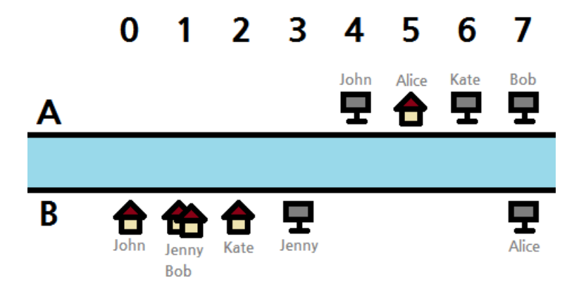
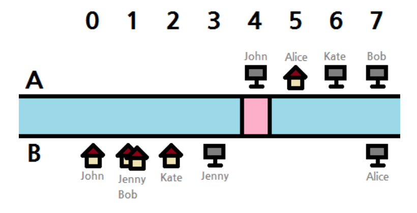
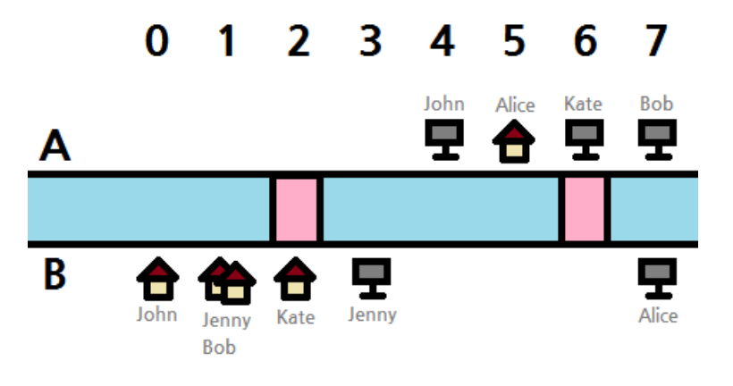

## 문제

도시 팔렘방 시에는 무시강이라는 이름의 강이 있어 도시가 두 구역으로 나뉘어 있다. 두 구역을 구역 A와 구역 B라고 부르자.

각 구역에는 강변을 따라 정확히 1,000,000,001개의 빌딩이 있고, 순서 대로 0 부터 1,000,000,000까지 번호가 붙어 있다. 인접한 빌딩 간의 거리는 정확히 1 단위거리이다. 강의 폭도 1단위거리이다. 구역 A의 빌딩 i는 구역 B의 빌딩 i의 정확히 강 건너편에 위치한다.

*N*명의 시민이 도시에서 살면서 일하고 있다. 시민 *i*는 구역 *P**i*의 빌딩 *S**i*에 살고 있고 사무실은 구역 *Q**i*의 빌딩 *T**i*에 있다. 사는 곳과 사무실이 다른 구역에 있는 경우에는 배를 타고 강을 건넜어야 했다. 물론 배를 타는 것이 불편하기 때문에 정부는 최대 *K*개의 다리를 건설해서 모든 시민이 배를 타지 않고 자동차로 출근이 가능하도록 만들고 싶다. 다리는 강 방향에 수직이라야 하며 겹칠 수 없다.

*D**i*를 최대 *K*개의 다리들이 건설된 후 시민 *i*가 사는 곳에서 사무실 까지 운전해서 갈 수 있는 최소 거리라고 하자. *D*1 + *D*2 + ... + *D**N*의 값 최소가 되도록 다리를 건설하는 방법을 알아내는 프로그램을 작성하라.

## 입력

입력의 첫 줄에는 *K*와 *N*이 주어진다. 이후 *N*개의 줄에는 4개의 값 *P**i*, *S**i*, *Q**i*, *T**i*가 각각 주어진다.

* *P**i*와 *Q**i*는 한글자 'A' 혹은 'B'이다.
* 0 ≤ *S**i*, *T**i* ≤ 1, 000, 000, 000
* 사는 곳이나 사무실이 서로 다른 시민에 대해서 같은 빌딩에 위치할 수 있고, 한 시민의 사는 곳이 다른 시민의 사무실과 같은 빌딩에 위치하는 것도 가능하다.
* 1 ≤ K ≤ 2
* 1 ≤ N ≤ 100, 000

## 출력

출력은 단 한줄이며 출근 거리 합의 최솟값을 출력해야 한다.

## 힌트

두 입력 예 모두에 대한 그림이다.

입력 예 1에 대한 가능한 해답이다. 분홍색 부분이 다리이다.

입력 예 2에 대한 가능한 해답이다.

